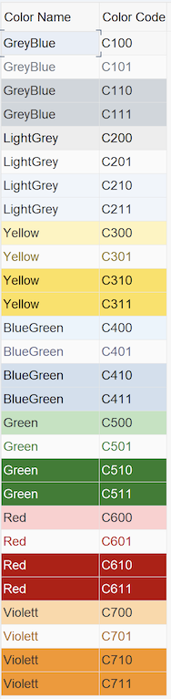

##### Color options:
  
  ``` abap
  CAST cl_salv_column_table( o_alv->get_columns(  )->get_column( 'KTEXT' ) )->set_color( VALUE lvc_s_colo( col = col_total int = 1 inv = 0 ) )
  ```
 
| name | code | Int (x) | Inv (y) | Color code |
|----|----|----|----|----|
| col_heading | 1 | 0/1 | 0/1 | 1xy |
| col_normal  | 2 | 0/1 | 0/1 | 2xy |
| col_total   | 3 | 0/1 | 0/1 | 3xy |
| col_key     | 4 | 0/1 | 0/1 | 4xy |
| col_positive| 5 | 0/1 | 0/1 | 5xy |
| col_negative| 6 | 0/1 | 0/1 | 6xy |
| col_group   | 7 | 0/1 | 0/1 | 7xy |




##### ALV selection mode:
``` abap
o_alv->get_selections( )->set_selection_mode( if_salv_c_selection_mode=>multiple ).
```

|  Mode  | 
| -| 
|  SINGLE |  
|  MULTIPLE |  
|  CELL |  
|  ROW_COLUMN |  
|  NONE |  