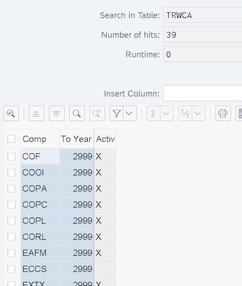
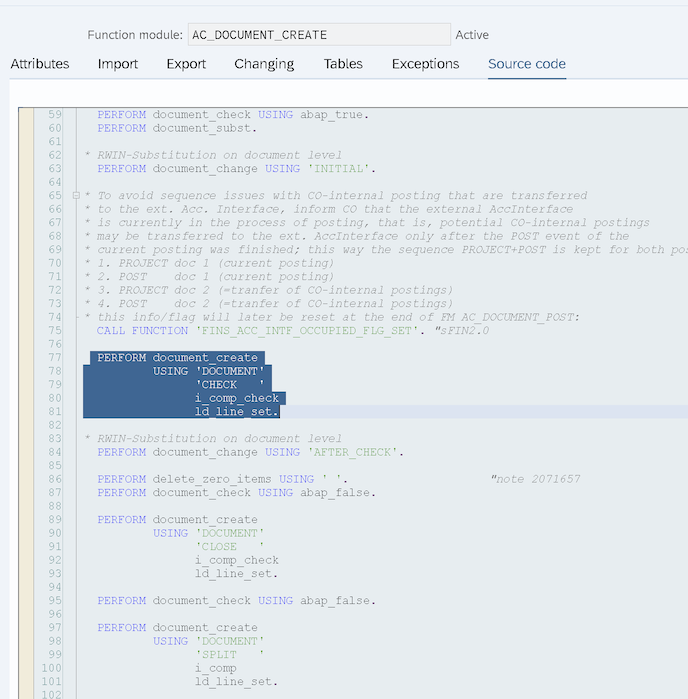
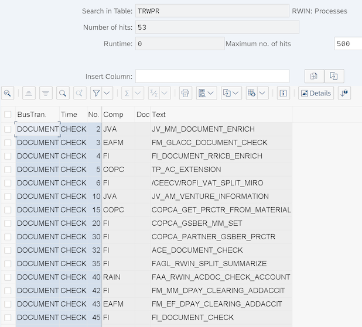
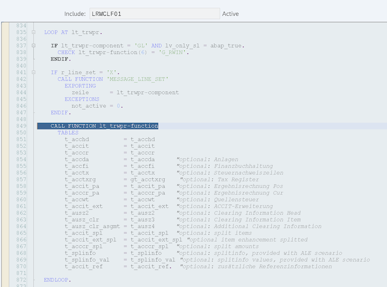

Простыми словами - RWIN интерфейс это список функциональных модулей и последовательность их вызова при создании FI документов. При создании любого документа в системе вызываются ФМ (функциональные модули) привязанные к событиям (технически это PROCESS и EVENT) в определенном порядке. Набор и порядок вызова - это и есть RWIN интерфейс

Таблица со списком ФМ вызываемых при формировании FI документа (по сути сам RWIN интерфейс) - **TRWPR**:

(Для примера, список функций при проверке FI документа):

При этом важно понимать что вызываются только те ФМ (имя ФМ в поле TRWPR-FUNCTION), для компонента (TRWPR-COMPONENT) которых в системе стоит метка активации.

Таблица с компонентами (и меткой активации) - **TRWCA**:

Ведение возможно через SM30

Сами же процессы (**TRWPR-PROCESS**) и события (**TRWPR-EVENT**) предопределенны SAP и обычно просто захардкожены, например в ФМ AC_DOCUMENT_CREATE это выглядит так:

и далее идет вызов ФМ из таблицы TRWPR с учетом активных компонентов (TRWCA)

