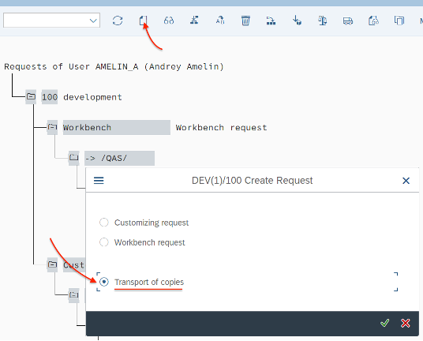
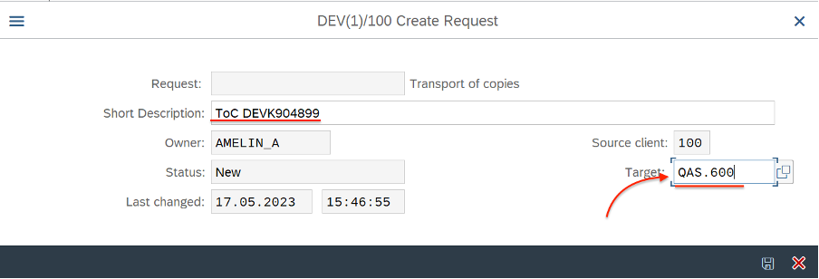
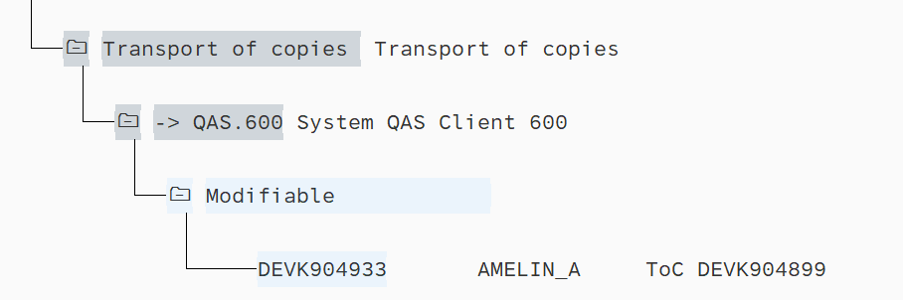
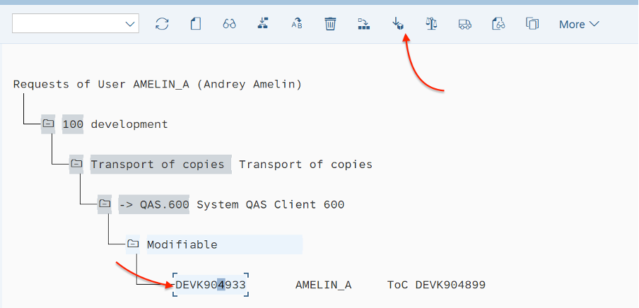
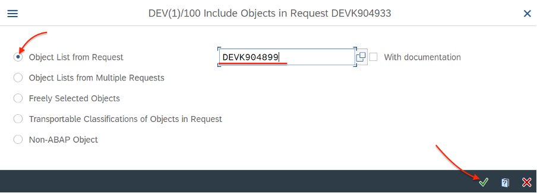
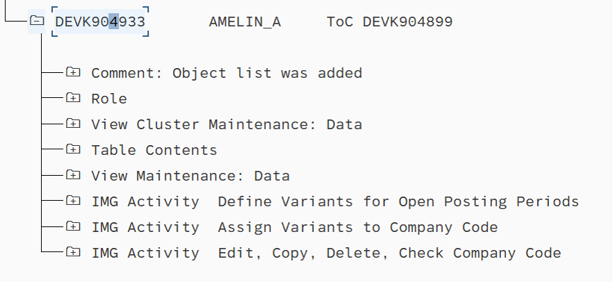

# Using Transport of copies requests

You can transport TR to other system (QAS) without releasing this TR. To do this - just create new “Transport of copies” TR (ToC) with objects from original TR, release and transport ToC to QAS.

## How it works

1. Run tcode `SE10` or any similar `SE*` tcode, create new TR, choose "Transport of copies"

2. Fill target system (System ID + client №, for example QAS.600)

Save it.
You’ll see new ToC TR into "Transport of copies" folder:

3. Select new ToC request and click on function "include objects" (**ctrl+F11**)

4. Select “original” TR/Task to include in ToC.

All entries from original TR will be added to ToC:

5. Release ToC (**F9**), and transport it  via `STMS` or `STMS_IMPORT` to target system