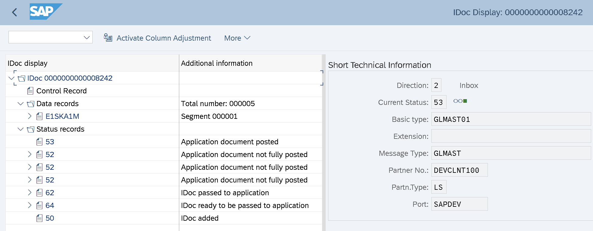

При создании/изменении счетов ГК (тр. **FS00** итд.) встает проблема с переносом этих изменений по системам/мандантам. В стандарте, данные по счетам ГК не включаются в транспортные запросы и есть несколько способов как перенести данные счетов в целевую систему:

# Перенос транспортными запросами

Данные по счетам ГК хранятся в следующих таблицах: **SKA1** - общий ракурс счета ГК **SKB1** - ракурс БЕ **SKAT** - текстовые расшифровки **CSKA/CSKB** - данные по видам затрат (актуально для счетов затрат/выручки)

Данные по счетам ГК можно включить вручную в запрос на перенос, например указав в явном виде таблицы в запросе R3TR-TABU-SKA1...

и указать там нужный ключ (например, для SKA1 - мандант+Псч+Номер счета)

Или открыть нужный ракурс в **SM30** и через него (меню) включить нужные строки в запрос, например так: **SM30->V_TIVEXFIACCKTP**

Далее перенести запрос по ландшафту как обычно

# Перенос через IDOCи (BD18)

Так же есть стандартный механизм для переноса данных счетов ГК по системам через IDOCи (тип сообщения **GLMAST**) Как это работает:

- Делаем изменения/создаем счета ГК в системе разработки
- Запускаем **BD18** и создаем IDOC с нужными нам данными по счетам ГК, указываем систему получатель
- Если все настроено корректно - изменения попадают в систему получателя автоматически
- Мониторить передачу данных можно в тр **BD87**

Пример как это работает:

1. создаем/изменяем счет в тр. ведения счетов **FS00** Было:

Стало:

2. Отправляем изменения из DEV во все системы по ландшафту (DEV, QAS, PRD) через тр **BD18**

IDOC в системе отправителя:

В системе получателя:

3. Результат в системе получателя (FS00->просмотр: текст счета изменен)

Что нужно настроить для того чтобы это работало:

- Настройки RFC соединений между системами **SM59**
- Настройки партнеров (LS) в **WE20**. Нужно прописать типы входящих/исходящих сообщений GLMAST
- Настройки глобальных компаний **OB72** и привязать эти компании к данным БЕ (**T001-BUKRS_GLOB**)