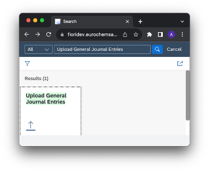
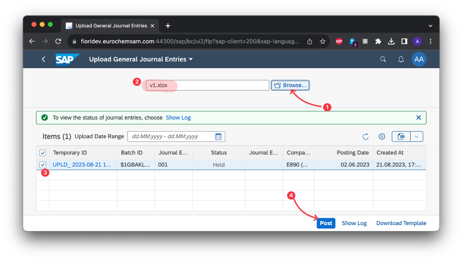
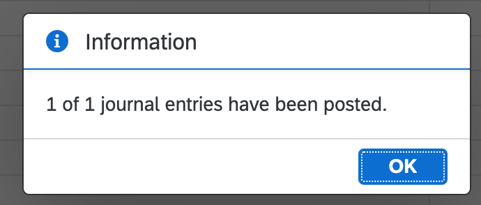
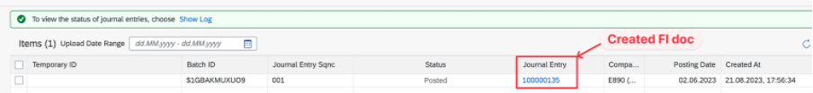
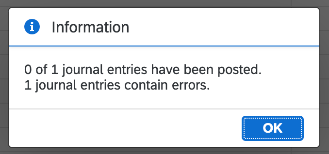
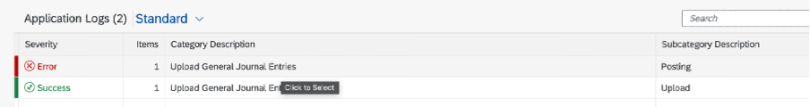

# Upload journal entries (FI docs) via FIORI app

## Step by step guide:

1. Run FIORI launchpad (via link or tcode `/n/ui2/flp`)
2. Find tile/app “Upload General Journal Entries” (tech ID **F2548**) and run it

3. Download template for uploading journal items:

[Template](IMGs/Worksheet%20in%201.7.Upload%20journal%20entries.xlsx)

4. Fill the template with postings info, save file
5. Upload filled template to FIORI app

6. Click “Post”

a. If everything is or – you’ll see the message like this:

And here you can find a list of posted documents:

b. In case of errors – you’ll see this message:

List of errors available at log:

## Tech info:

- [FIORI app (App ID **F2548**)](https://fioriappslibrary.hana.ondemand.com/sap/fix/externalViewer/#/detail/Apps('F2548')/S26OP)
- odata service `FAC_GL_DOCUMENT_POST_SRV` via tcode `/N/IWFND/MAINT_SERVICE`