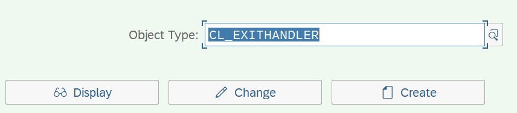
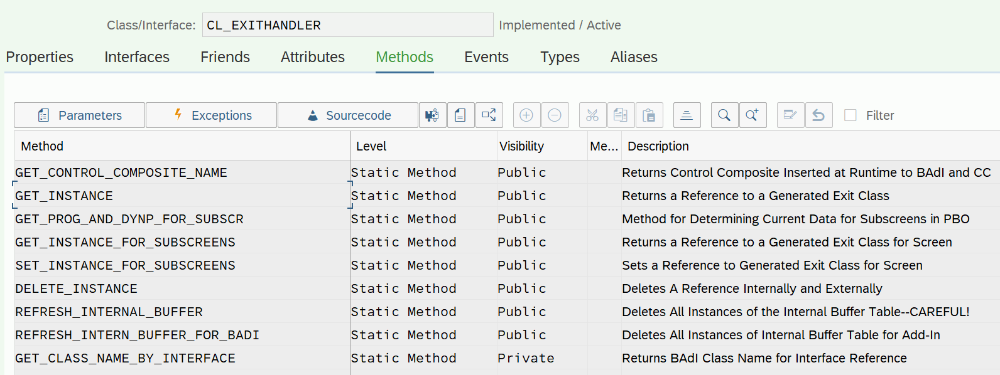
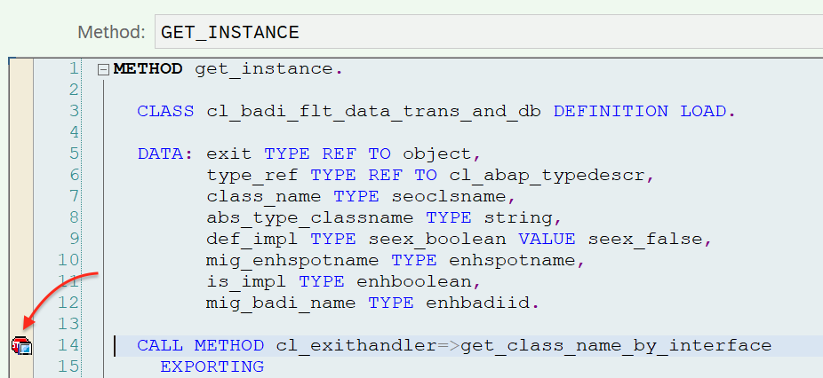
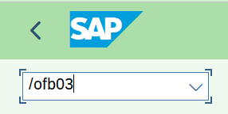
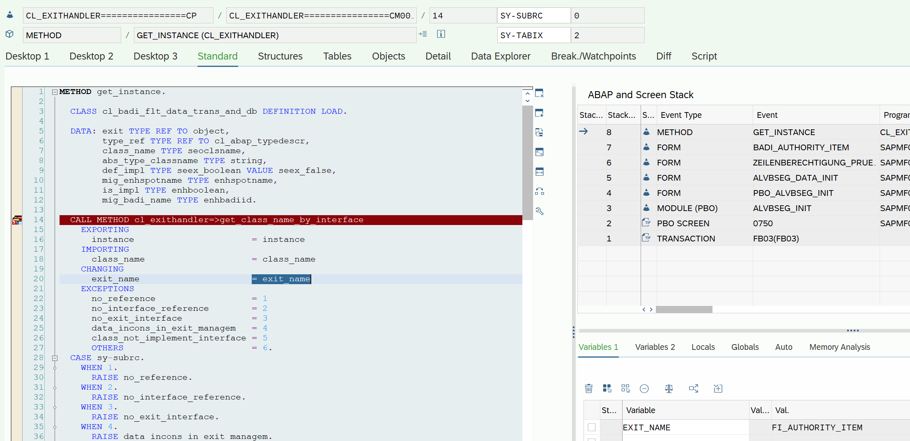
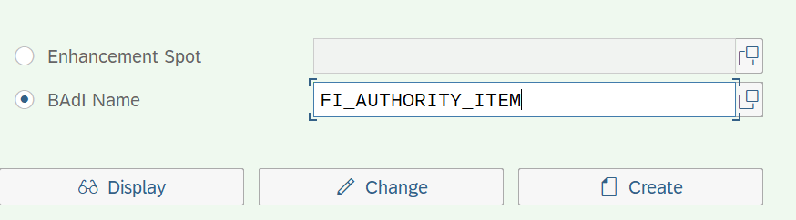
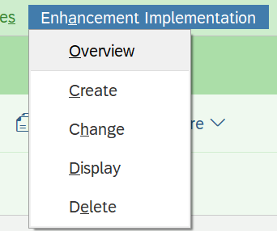
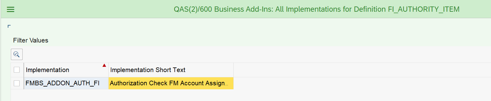

Simple way how to find BAdIs at any tcode.

Before calling any BAdI (even without implementation), the `GET_INSTANCE` method of the `CL_EXITHANDLER` class is called in the system.

How to find BAdIs lists:

1. Run tcode `SE24` and put class `CL_EXITHANDLER`

2. Go to  "Display"

3. Drilldown to method `GET_INSTANCE` and put a break point at a first abap code line

4. Close `SE24` or open a new session with a tcode which need to be enhanced (via BAdI), for example tcode `FB03`:

And when calling any BAdI we get into the debugger:

The variable `EXIT_NAME` will contain the name of the BAdI. In our case, it is `FI_AUTHORITY_ITEM`. Further, by pressing F8 you can find other called BAdI

 BAdI definition available at tcode `SE18`

There you can also see all the implementations of this BAdI through the menu:

 BAdI implementation available via  `SE19`