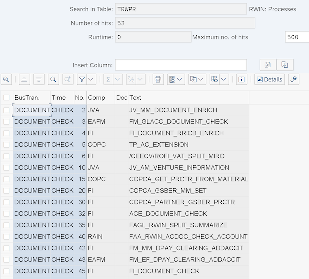
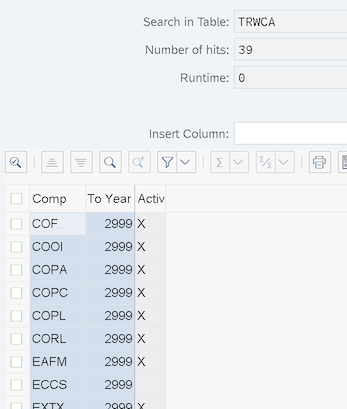
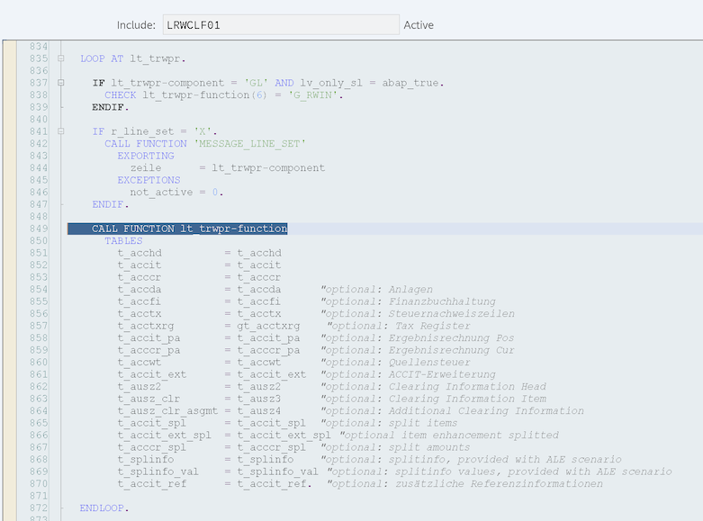

# RWIN Interface

In simple terms, the RWIN interface is a list of functional modules and the sequence of their calls when creating FI documents. When creating any FI related document in the SAP system, FMs (functional modules) are called, linked to events (technically, these are PROCESS and EVENT) in a certain order. The set and order of calls is the RWIN interface

A table with a list of FMs called when forming an FI document (essentially the RWIN interface itself) - **TRWPR**:

(For example, a list of functions when checking an FI document):

It is important to understand that only those FMs (FM name in the TRWPR-FUNCTION field) are called for the component (TRWPR-COMPONENT) for which the activation label is set in the system.

Table with components is (and activation status) - **TRWCA**:

Maintained via tcode **SM30**

The processes (**TRWPR-PROCESS**) and events (**TRWPR-EVENT**) themselves are predefined by SAP and are usually simply hardcoded, for example, in the **AC_DOCUMENT_CREATE** FM it looks like this:

and then comes the call of FMs from the TRWPR table taking into account the active components (**TRWCA**)

