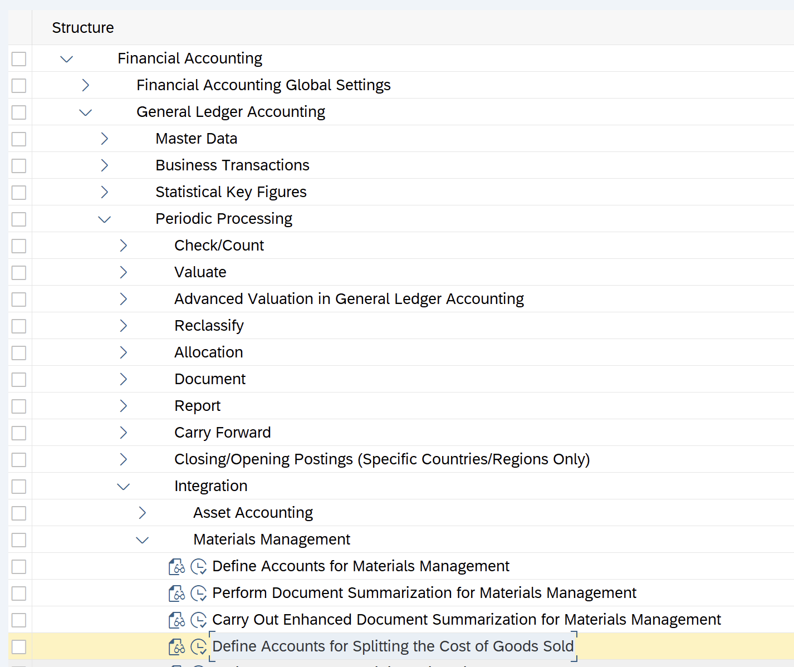
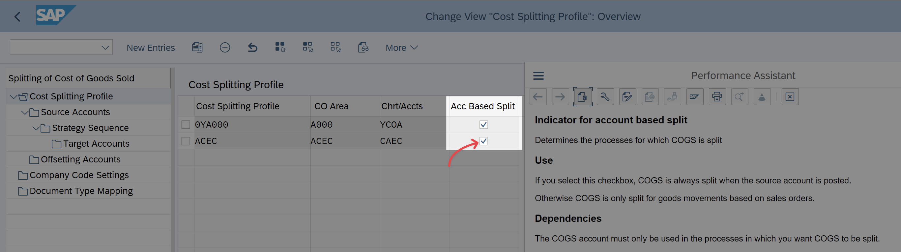
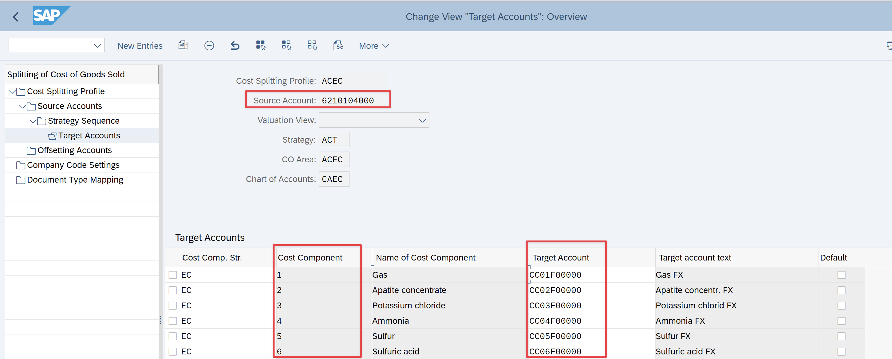
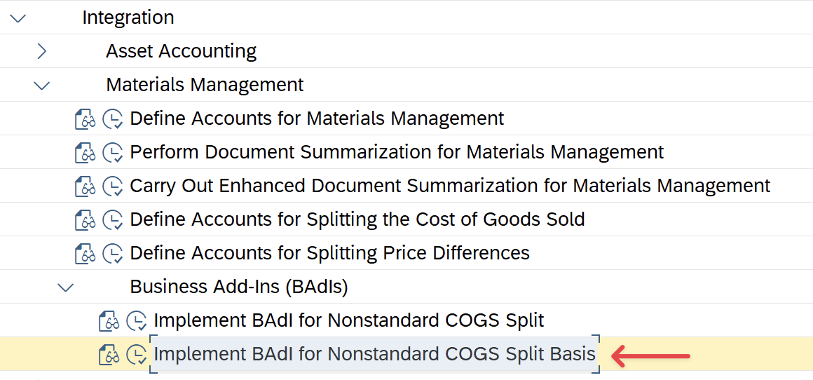

# Split COGS account by cost components (ML)

You can set-up SAP system to post a two FI documents for each outbound delivery:

- Ordinary doc for Cr FG inventory Dr COGS
- Additional document to split COGS by cost components (Cr Tech, Dr COGS CC1, Dr COGS CC2 etc).

Also, ML closing postings will revaluate this additional postings too.

As a result you'll be able to see on a GL level COGS splitting by cost component

To set an automatic split of COGS accounts by cost components on a GL level you need to activate this customizing:

**Financial Accounting → General Ledger Accounting** → **Periodic Processing** → **Integration** → **Materials Management** → **Define Accounts for Splitting the Cost of Goods Sold**



At first - activate this option:



And create a mapping for cost component → GL account (here's a CC* account for cost component split, named like “CC”+CostComponent)



To split **variable and fixed** costs by GL account BAdI `FCO_COGS_SPLIT_BASIS` should be implemented, SPRO path to BAdI:



You need to put a custom logic at method `CHANGE_COGS_SPLIT_BASIS`, for example like this:

<aside>

Here's an additional COGS accounts with 4th chars "V”for variable costs and "F”for fixed.

"F” accounts customized at standard account determination above

</aside>

```abap
  METHOD if_fco_cogs_split_basis~change_cogs_split_basis.
      DATA: ls_split_factor LIKE LINE OF cts_split_factor.
      LOOP AT cts_split_factor ASSIGNING FIELD-SYMBOL(<split_factor>) WHERE hkont+4(1) = 'F'.
        "add fix
        IF <split_factor>-weight_total - <split_factor>-weight_fix <> 0.
          CLEAR: ls_split_factor.
          ls_split_factor-hkont = <split_factor>-hkont.
          ls_split_factor-hkont+4(1) = 'V'.
          ls_split_factor-valutyp = <split_factor>-valutyp.
          ls_split_factor-weight_total = <split_factor>-weight_total - <split_factor>-weight_fix.
          ls_split_factor-weight_fix = <split_factor>-weight_fix.
          INSERT ls_split_factor INTO TABLE cts_split_factor.
        ENDIF.
        "calc var
        <split_factor>-weight_total = <split_factor>-weight_fix.
      ENDLOOP.
  ENDMETHOD.
```

<aside>

To repost COGS split documents use tcode `FCO_COGS_SPLIT_REPOST`

</aside>