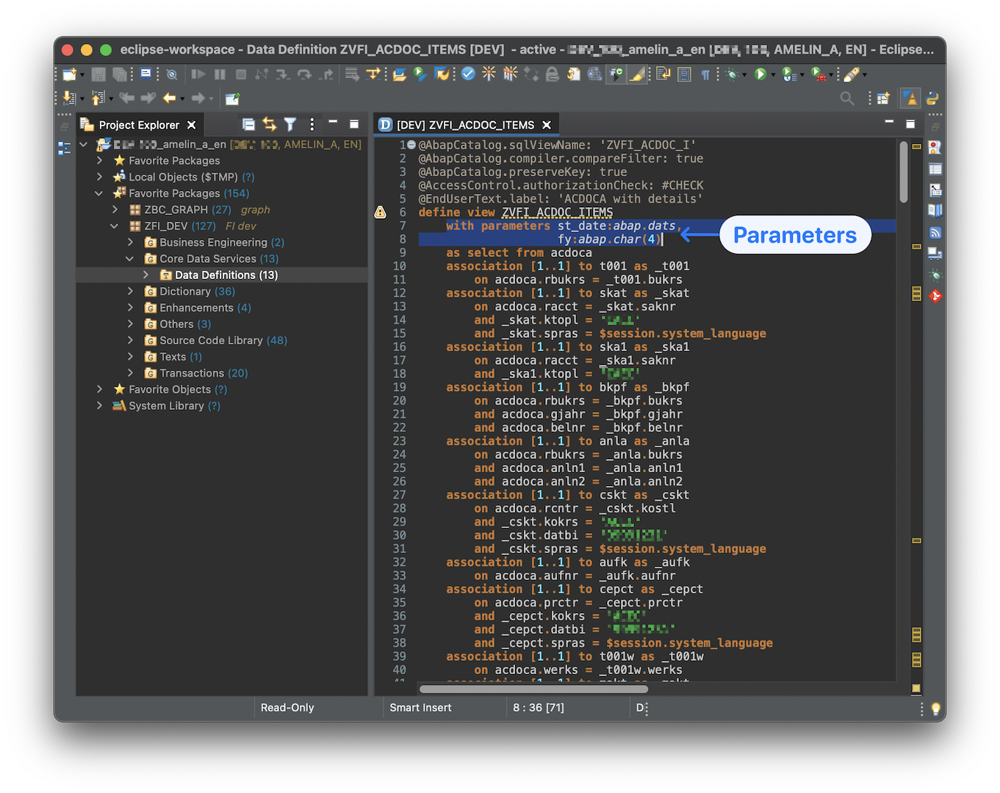
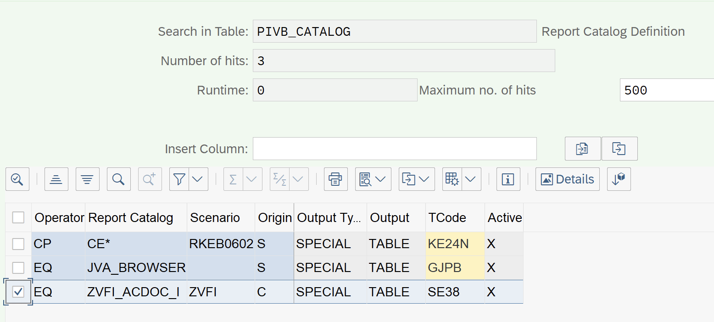

PIVB отчеты позволяют формировать сводные отчеты и на лету добавлять в отчет аналитики (т.е. столбцы), при этом при добавлении столбцов пересчитываются данные в отчете, т.е. может изменится и количество строк. Простыми словами это работает так же как механизм сводных таблиц в Excel. Для примера можно посмотреть стандартные отчеты типа **FAGLL03H**, **FBL1H** итд

Внешне, такие отчеты можно отличить по наличию сайдбара справа (при желании его можно и переместить в левую сторону), и новым механизмом работы с форматами (layout) отчетов, который позволяет формировать набор столбцов на лету (ad-hoc).

Пример такого отчета:



Описание от SAP и технические детали в ноте [2100879](https://launchpad.support.sap.com/#/notes/2100879)

**Как сделать свой простой PIVB отчет:**
1) Вам нужна таблица(ы) или CDS с данными из которых будет осуществляться выборка. В примере ниже будем использовать Z CDS (на основе ACDOCA) с параметрами (в виде дат и года).

2) Создаем Z программу для нашего отчета (для примера можно использовать как образец отчет RFPIVB_EX_SFLIGHT_01)
В программе рисуем свой селекционный экран:
```abap
REPORT zfi_glrep_items_pivb.
TABLES: zvfi_acdoc_i.

SELECTION-SCREEN BEGIN OF BLOCK bl1 WITH FRAME TITLE TEXT-001.
  SELECT-OPTIONS: so_rldnr FOR zvfi_acdoc_i-rldnr NO INTERVALS DEFAULT '0L',
                  so_bukrs FOR zvfi_acdoc_i-rbukrs MEMORY ID buk,
                  so_gjahr FOR zvfi_acdoc_i-gjahr OBLIGATORY no-EXTENSION no INTERVALS DEFAULT sy-datum+0(4),
                  so_budat FOR zvfi_acdoc_i-budat OBLIGATORY NO-EXTENSION,
                  so_racct FOR zvfi_acdoc_i-racct,
                  so_KTOKS FOR zvfi_acdoc_i-ktoks,
                  so_LOKKT FOR zvfi_acdoc_i-lokkt,
                  so_koart FOR zvfi_acdoc_i-koart.
SELECTION-SCREEN END OF BLOCK bl1.

SELECTION-SCREEN BEGIN OF BLOCK bl2 WITH FRAME TITLE TEXT-002.
  PARAMETERS: p_sb AS CHECKBOX.
  PARAMETERS: p_disvar TYPE  slis_vari MODIF ID p_d.
SELECTION-SCREEN END OF BLOCK bl2.
```

И обработку выбора вариантов:
```abap
AT SELECTION-SCREEN ON VALUE-REQUEST FOR p_disvar.
* service FM PIVB_F4
  CALL FUNCTION 'PIVB_F4'
    EXPORTING
      i_report_catalog  = con_catalog
      i_report_scenario = con_scenario
    IMPORTING
      e_layout          = p_disvar
      e_result_status   = g_result_status
      e_layout_name     = g_layout_name
    CHANGING
      ct_field          = gt_column
    EXCEPTIONS
      error_message     = 4.
  IF sy-subrc = 4.
    "Do nothing, same error will be also raised during execution
    "(and is not possible raise messages in F4 Help event)
  ENDIF.

* update screen with description of the selected layout
  IF g_result_status = if_pivb_c_f4=>result_field.
    MESSAGE i014(pivb) INTO g_txt.
    g_layout_name = g_txt.
    MESSAGE i013(pivb) INTO g_txt.
    PERFORM update_screen.
  ELSEIF g_result_status = if_pivb_c_f4=>result_layout.
    MESSAGE i012(pivb) INTO g_txt.
    PERFORM update_screen.
  ENDIF.


FORM update_screen.
  DATA:
    ls_dynpfield TYPE dynpread,
    lt_dynpfield TYPE TABLE OF dynpread.

  CLEAR: lt_dynpfield[], ls_dynpfield.

  ls_dynpfield-fieldname = 'P_DISVAR'.
  ls_dynpfield-fieldvalue = p_disvar.
  APPEND ls_dynpfield TO lt_dynpfield.

  ls_dynpfield-fieldname = 'COMM01'.
  ls_dynpfield-fieldvalue = g_layout_name.
  APPEND ls_dynpfield TO lt_dynpfield.

  ls_dynpfield-fieldname = 'COMM02'.
  ls_dynpfield-fieldvalue = g_txt(con_msg_lenght).
  APPEND ls_dynpfield TO lt_dynpfield.

  CALL FUNCTION 'DYNP_VALUES_UPDATE'
    EXPORTING
      dyname     = sy-repid
      dynumb     = sy-dynnr
    TABLES
      dynpfields = lt_dynpfield.
ENDFORM.
```

В основном теле программы перекладываем данные с селекционного экрана в струкуры для работы с PIVB (через ФМ **PIVB_CONV_RANGE_TO_SELTAB**)

```abap
* convert the entered values into standard PIVB format
  PERFORM convert_to_seltab USING 'RBUKRS' so_bukrs[]  CHANGING gt_seltab.
  PERFORM convert_to_seltab USING 'RLDNR' so_rldnr[]  CHANGING gt_seltab.
  PERFORM convert_to_seltab USING 'BUDAT' so_budat[]  CHANGING gt_seltab.
  PERFORM convert_to_seltab USING 'RACCT' so_racct[]  CHANGING gt_seltab.
  PERFORM convert_to_seltab USING 'KTOKS' so_KTOKS[]  CHANGING gt_seltab.
  PERFORM convert_to_seltab USING 'LOKKT' so_LOKKT[]  CHANGING gt_seltab.
  PERFORM convert_to_seltab USING 'KOART' so_koart[]  CHANGING gt_seltab.

FORM convert_to_seltab USING
                         us_fname   TYPE rsdstabs-prim_fname
                         fs_table   TYPE ANY TABLE
                       CHANGING
                         ct_seltab  TYPE rsds_frange_t.
  CALL FUNCTION 'PIVB_CONV_RANGE_TO_SELTAB'
    EXPORTING
      i_fname   = us_fname
      it_table  = fs_table
    CHANGING
      ct_seltab = ct_seltab.
ENDFORM.
```

Объявляем константы с именем отчета (их надо будет прописать в настроечных таблицах PIVB и в реализации **BAdI PIVB**, про это будет далее)

```abap
CONSTANTS con_catalog         TYPE pivb_report_catalog  VALUE 'ZVFI_ACDOC_I'.
CONSTANTS con_scenario        TYPE pivb_report_scenario VALUE 'ZVFI'.
```

И вызываем основной ФМ **PIVB_CONV_RANGE_TO_SELTAB** для выборки данных и отражения PIVB ALV отчета 

```abap
* call the main PIVB FM with all necessary parameters
  CALL FUNCTION 'PIVB_SELECT_AND_DISPLAY'
    EXPORTING
      i_report_catalog     = con_catalog
      i_report_scenario    = con_scenario
      it_seltab            = gt_seltab
      i_layout             = p_disvar
      it_column_visibility = gt_column
      it_param             = lt_par.
```

В наш отчет готов, но пока не работает. Итоговый код такой:

```abap
*&---------------------------------------------------------------------*
*& Report ZFI_GLREP_ITEMS_PIVB
*&---------------------------------------------------------------------*
*Amelin A.
*Based on PIVB functionality
*Customizing at table:
*PIVB_CATALOG
*Selection logic at BADI (EnhPoint)
*PIVB
*&---------------------------------------------------------------------*
REPORT zfi_glrep_items_pivb.
TABLES: zvfi_acdoc_i.
**********************************************************************
CONSTANTS con_catalog         TYPE pivb_report_catalog  VALUE 'ZVFI_ACDOC_I'.
CONSTANTS con_scenario        TYPE pivb_report_scenario VALUE 'ZVFI'.
CONSTANTS con_msg_lenght      TYPE i VALUE 73.
**********************************************************************
DATA:
  g_function_active TYPE c,
  g_fund_active     TYPE c,
  g_measure_active  TYPE c,
  g_grant_active    TYPE c,
  g_bud_per_active  TYPE c,
  gt_seltab         TYPE pivb_frange_t,
  gs_seltab         LIKE LINE OF gt_seltab,
  gt_column         TYPE pivb_column_f4_t,
  g_result_status   TYPE char6,
  g_layout_name     TYPE slis_varbz,
  g_txt             TYPE camsg.
**********************************************************************
SELECTION-SCREEN BEGIN OF BLOCK bl1 WITH FRAME TITLE TEXT-001.
  SELECT-OPTIONS: so_rldnr FOR zvfi_acdoc_i-rldnr NO INTERVALS DEFAULT '0L',
                  so_bukrs FOR zvfi_acdoc_i-rbukrs MEMORY ID buk,
                  so_gjahr FOR zvfi_acdoc_i-gjahr OBLIGATORY no-EXTENSION no INTERVALS DEFAULT sy-datum+0(4),
                  so_budat FOR zvfi_acdoc_i-budat OBLIGATORY NO-EXTENSION,
                  so_racct FOR zvfi_acdoc_i-racct,
                  so_KTOKS FOR zvfi_acdoc_i-ktoks,
                  so_LOKKT FOR zvfi_acdoc_i-lokkt,
                  so_koart FOR zvfi_acdoc_i-koart.
SELECTION-SCREEN END OF BLOCK bl1.

SELECTION-SCREEN BEGIN OF BLOCK bl2 WITH FRAME TITLE TEXT-002.
  PARAMETERS: p_sb AS CHECKBOX.
  PARAMETERS: p_disvar TYPE  slis_vari MODIF ID p_d.
SELECTION-SCREEN END OF BLOCK bl2.
**********************************************************************
INITIALIZATION.
  APPEND VALUE #( sign = 'I' option = 'BT'  low = sy-datum+0(4) && |{ sy-datum+4(2) }| && '01'  high = sy-datum ) TO so_budat.
**********************************************************************
AT SELECTION-SCREEN ON VALUE-REQUEST FOR p_disvar.
* service FM PIVB_F4
  CALL FUNCTION 'PIVB_F4'
    EXPORTING
      i_report_catalog  = con_catalog
      i_report_scenario = con_scenario
    IMPORTING
      e_layout          = p_disvar
      e_result_status   = g_result_status
      e_layout_name     = g_layout_name
    CHANGING
      ct_field          = gt_column
    EXCEPTIONS
      error_message     = 4.
  IF sy-subrc = 4.
    "Do nothing, same error will be also raised during execution
    "(and is not possible raise messages in F4 Help event)
  ENDIF.

* update screen with description of the selected layout
  IF g_result_status = if_pivb_c_f4=>result_field.
    MESSAGE i014(pivb) INTO g_txt.
    g_layout_name = g_txt.
    MESSAGE i013(pivb) INTO g_txt.
    PERFORM update_screen.
  ELSEIF g_result_status = if_pivb_c_f4=>result_layout.
    MESSAGE i012(pivb) INTO g_txt.
    PERFORM update_screen.
  ENDIF.
**********************************************************************
AT SELECTION-SCREEN.
  if so_gjahr-low = so_budat-low+0(4) and so_gjahr-low = so_budat-high+0(4).
  ELSE.
    MESSAGE 'Dates should be in one fiscal year' TYPE 'E'.
  ENDIF.
**********************************************************************
AT SELECTION-SCREEN OUTPUT.
**********************************************************************
START-OF-SELECTION.
* convert the entered values into standard PIVB format
  PERFORM convert_to_seltab USING 'RBUKRS' so_bukrs[]  CHANGING gt_seltab.
  PERFORM convert_to_seltab USING 'RLDNR' so_rldnr[]  CHANGING gt_seltab.
  DATA: lt_par TYPE PIVB_PARAM_T,
        ls_par LIKE LINE OF lt_par.
  ls_par-PARAMNAME = 'ST_DATE'.
  ls_par-CUSTOM = so_budat-low.
  APPEND ls_par to lt_par.
  ls_par-PARAMNAME = 'FY'.
  ls_par-CUSTOM = so_gjahr-low.
  APPEND ls_par to lt_par.
  IF p_sb ne 'X'.
    READ TABLE so_budat ASSIGNING FIELD-SYMBOL(<fs_b>) INDEX 1.
    <fs_b>-low = so_budat-low = '00000000'.
    UNASSIGN <fs_b>.
  ENDIF.
  PERFORM convert_to_seltab USING 'BUDAT' so_budat[]  CHANGING gt_seltab.
  PERFORM convert_to_seltab USING 'RACCT' so_racct[]  CHANGING gt_seltab.
  PERFORM convert_to_seltab USING 'KTOKS' so_KTOKS[]  CHANGING gt_seltab.
  PERFORM convert_to_seltab USING 'LOKKT' so_LOKKT[]  CHANGING gt_seltab.
  PERFORM convert_to_seltab USING 'KOART' so_koart[]  CHANGING gt_seltab.
* call the main PIVB FM with all necessary parameters
  CALL FUNCTION 'PIVB_SELECT_AND_DISPLAY'
    EXPORTING
      i_report_catalog     = con_catalog
      i_report_scenario    = con_scenario
      it_seltab            = gt_seltab
      i_layout             = p_disvar
      it_column_visibility = gt_column
      it_param             = lt_par.

**********************************************************************
FORM convert_to_seltab USING
                         us_fname   TYPE rsdstabs-prim_fname
                         fs_table   TYPE ANY TABLE
                       CHANGING
                         ct_seltab  TYPE rsds_frange_t.
  CALL FUNCTION 'PIVB_CONV_RANGE_TO_SELTAB'
    EXPORTING
      i_fname   = us_fname
      it_table  = fs_table
    CHANGING
      ct_seltab = ct_seltab.
ENDFORM.

**********************************************************************
FORM update_screen.
  DATA:
    ls_dynpfield TYPE dynpread,
    lt_dynpfield TYPE TABLE OF dynpread.

  CLEAR: lt_dynpfield[], ls_dynpfield.

  ls_dynpfield-fieldname = 'P_DISVAR'.
  ls_dynpfield-fieldvalue = p_disvar.
  APPEND ls_dynpfield TO lt_dynpfield.

  ls_dynpfield-fieldname = 'COMM01'.
  ls_dynpfield-fieldvalue = g_layout_name.
  APPEND ls_dynpfield TO lt_dynpfield.

  ls_dynpfield-fieldname = 'COMM02'.
  ls_dynpfield-fieldvalue = g_txt(con_msg_lenght).
  APPEND ls_dynpfield TO lt_dynpfield.

  CALL FUNCTION 'DYNP_VALUES_UPDATE'
    EXPORTING
      dyname     = sy-repid
      dynumb     = sy-dynnr
    TABLES
      dynpfields = lt_dynpfield.
ENDFORM.
```

3) Заполнение настроечных таблиц PIVB
Есть 4 основные настроечные таблицы:
* PIVB_CATALOG                   Report Catalog Definition
* PIVB_FEATURE                   Features of Pivot Browser reports
* PIVB_FIELD                     Characteristics of Report Catalog Field
* PIVB_FIELDMAP                  Field Mapping: Report Catalog to DB Table

Для простого примера нам достаточно определить наш отчет только в PIVB_CATALOG (через **SM30**):



4) Далее необходимо создать реализацию точки расширения PIVB (**se18/19**), есть стандартный пример реализации **SAP_SFLIGHT_01**
Создаем свою реализацию и в фильтрах указываем значения из п.3

> 🖼️ _(скриншот отсутствует — оригинал был во вложениях GitHub, добавить вручную)_

Для простого отчета нам нужно реализовать только метод IF_EX_PIVB~**SELECT** в котором можно переопределить механизм выборки данных
для нашего примера это будет так:

```abap
method if_ex_pivb~select.
  data lt_trange                  type rsds_trange.
  data lt_trange_and              type pivb_trange_t.
  data lt_select                  type standard table of string.
  data lt_group_by                type standard table of string.
  data lt_group_by_checked        type standard table of string.
  data lt_field_mapping           type pivb_fieldmap_short_t.
  data l_column                   type string.
  data l_tabname                  type tabname.
  data oref                       type ref to cx_root.
  data lt_where                   type rsds_where_tab.
  field-symbols <fs_item>         type any.
  constants lc_tabname            type tabname  value 'ZVFI_ACDOC_I'.
  constants lc_devclass           type devclass value 'ZFI_DEV'. "package of the table

  me->get_security_metadata( i_report_catalog = i_report_catalog ).

  call function 'PIVB_SQL_GET_CLAUSE'
    exporting
      i_report_catalog            = i_report_catalog
      i_report_scenario           = i_report_scenario
      it_seltab                   = it_seltab
      it_and_seltab               = it_and_seltab
      it_column                   = it_column
      it_column_metadata          = it_column_metadata
      i_tabname                   = lc_tabname
      it_table_sec                = me->mt_secure_whitelist
      ut_fieldmap                 = lt_field_mapping
      I_STRICT_MODE               = 'X'
    importing
      et_select                   = lt_select
      et_group_by                 = lt_group_by
      et_trange                   = lt_trange[]
      et_trange_and               = lt_trange_and[].

  LOOP AT lt_select ASSIGNING FIELD-SYMBOL(<sel>).
    CHECK <sel>+0(4) = 'SUM('.
    REPLACE '(' in <sel> WITH `( `.
    REPLACE ')' in <sel> WITH ' )'.
  ENDLOOP.

**********************************************************************
  call function 'PIVB_CONV_RANGE_TO_WHERE'
    exporting
      it_trange           = lt_trange[]
      it_trange_and       = lt_trange_and[]
    importing
      et_where            = lt_where[].

* GROUP BY
  loop at lt_group_by into l_column.
    append l_column to lt_group_by_checked.
  endloop.
  free lt_group_by.

* DO SELECT
***********************************************************************
  DATA: st_date TYPE dats,
        fy TYPE gjahr.
  LOOP AT CT_PARAM ASSIGNING FIELD-SYMBOL(<fs_p>).
    CASE <fs_p>-PARAMNAME.
      WHEN 'ST_DATE'.
        st_date = <fs_p>-CUSTOM.
      WHEN 'FY'.
        fy = <fs_p>-CUSTOM.
      WHEN OTHERS.
    ENDCASE.
  ENDLOOP.
  try.
    select (lt_select)
      from ZVFI_ACDOC_ITEMS( st_date = @st_date,
                             fy = @fy )
      where (lt_where)
      group by (lt_group_by_checked)
      into corresponding fields of TABLE @ct_outtab.
  catch cx_sy_open_sql_db into oref.
    data: l_txt type string.
    l_txt = oref->get_text( ) ##MG_MISSING.
    message e017(pivb) with lc_tabname l_txt space space raising sql_error.
  endtry ##MG_MISSING.
endmethod.
```

Обратите внимание, для использования нового синтаксиса запросов необходимо установить параметр **I_STRICT_MODE = 'X'** и немного доработать механизм заполнения внутренней таблицы lt_select (добавить пробелы в динамические параметры запроса).

В методе IF_EX_PIVB~GRID_METADATA_CHANGE можно подкрутить параметры отображения ALV (филдкаталог), для примера так:

> 🖼️ _(скриншот отсутствует — оригинал был во вложениях GitHub, добавить вручную)_

Активируем реализацию расширения, активируем наш отчет. Результат:
Селекционный экран с новм механизмом выбора форматов (кнопка "select columns"):

> 🖼️ _(скриншот отсутствует — оригинал был во вложениях GitHub, добавить вручную)_

Сам отчет:

> 🖼️ _(скриншот отсутствует — оригинал был во вложениях GitHub, добавить вручную)_
