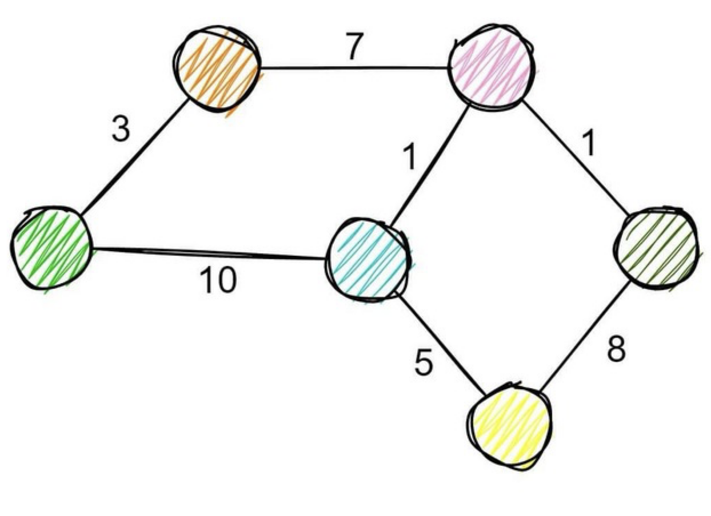

# Graphs in SAP via Graphviz (HTML)

# What is [graph](https://en.wikipedia.org/wiki/Graph_(discrete_mathematics))?

A graph is a structure consisting of a [set](https://en.wikipedia.org/wiki/Set_(mathematics) "Set (mathematics)") of objects where some pairs of the objects are in some sense "related". The objects are represented by abstractions called _[vertices](https://en.wikipedia.org/wiki/Vertex_(graph_theory) "Vertex (graph theory)")_ (also called nodes or points) and each of the related pairs of vertices is called an edge (also called link or line)

# What is Graphviz?

[Graphviz](https://graphviz.org) is open source graph visualization software. Graph visualization is a way of representing structural information as diagrams of abstract graphs and networks. It has important applications in networking, bioinformatics, software engineering, database and web design, machine learning, and in visual interfaces for other technical domains.

# How to show graph in SAP?

