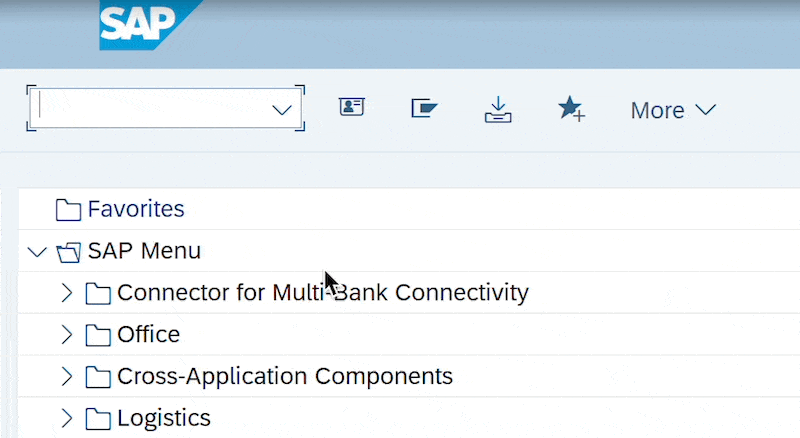

Иногда удобно иметь возможность на лету переключить язык входа в SAP систему в SAP Logon.

Концепция:

Установить язык через 

```abap
SET LOCALE LANGUAGE 'E'.
```

Вызвать новую сессию через

```abap
CALL FUNCTION 'ABAP4_CALL_TRANSACTION' STARTING NEW TASK 'LANGUAGE'
```

и закрыть текущую сессию.

Пример реализации:
1) Создаем программу, например **ZBC_LANG**

```abap
REPORT ZBC_LANG.
CASE sy-tcode.
  WHEN 'ZEN'. SET LOCALE LANGUAGE 'E'.
  WHEN 'ZRU'. SET LOCALE LANGUAGE 'R'.
  WHEN 'ZPT'. SET LOCALE LANGUAGE 'P'.
* WHEN 'Zxx'. SET LOCALE LANGUAGE 'x'.
  WHEN OTHERS.
    exit.
ENDCASE.

CALL FUNCTION 'ABAP4_CALL_TRANSACTION' STARTING NEW TASK 'LANGUAGE'
  EXPORTING
    tcode = 'SESSION_MANAGER'.
```

2) Создаем N транзакций вида Z<язык>, например **ZEN**, **ZPT**, **ZRU** итд. В них прописывем вызов программы **ZBC_LANG**

3) Для переключения языка в окне транзакций запускаем **/nZ<язык>**, например **/nzEN, /nzRU**...

До:



После:

> 🖼️ _(скриншот отсутствует — оригинал был во вложениях GitHub, добавить вручную)_


---
**Исходный код:**
- [ZBC_LANG_EN.abap](../90%20Source%20code/ZBC_LANG_EN.abap)
