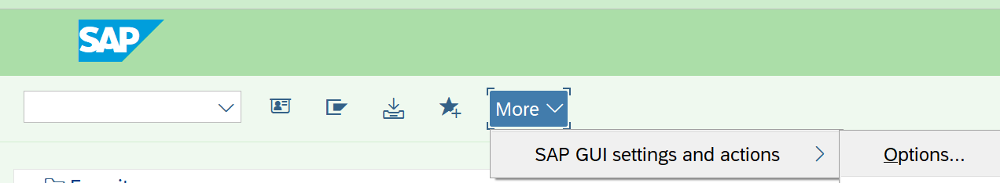

В SAP Logon есть возможность раскрасить разные системы/манданты в разные цвета. Это может быть удобно при работе с несколькими системами, чтобы случайно что то не сделать не в той системе. Например можно покрасить DEV систему в синий цвет, QAS в зеленый, PRD в красный итд.

Как это делается:
Зайти в настройки в SAP Logon

Далее выбрать нужный цвет для системы в целом (вверху) или для системы+ мандант (внизу)

Применить настройки и перезапустить SAP Logon.

Еще полезные настройки:

Показывать ключ в раскрывающихся списках, например так:

Настраивается тут:

Для SAP Logon 760 можно вернуть кнопки в меню как были раньше, делается тут:

Так же можно активировать автозаполнение (по пробелу) значений в полях для длинных полей, делается тут:

Начиная с версии 750 в SAP Logon нет возможности сохранять логин+пароль (если у вас нет SSO), но можно сделать ярлыки (для WIN) вида:

`"C:\Program Files (x86)\SAP\FrontEnd\SAPgui\sapshcut.exe" XXX.XXX.XXX.XXX -user=USERNAME -pw=PASSWORD -system=SYS -Client=YYY -language=EN`
