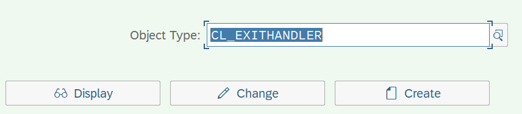
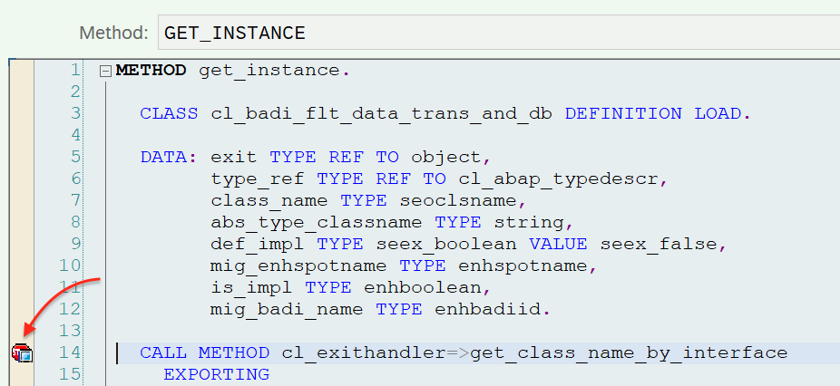
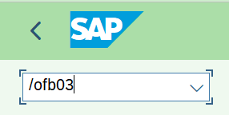
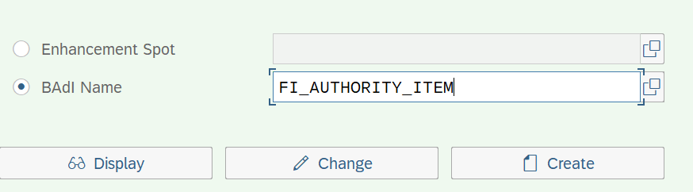
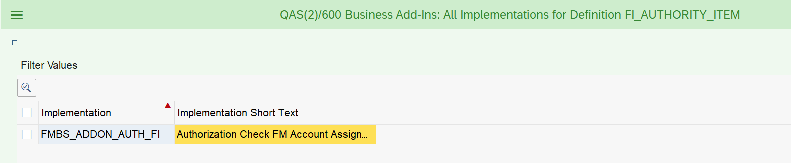

# Поиск BAdI в любой транзакции

Простой способ как найти вызываемые BAdI в любой транзакции.

Перед вызовом любой BAdI (даже без реализации) в системе вызывается метод **GET_INSTANCE** класса **CL_EXITHANDLER**.

Процедура поиска:
1. Открываем **SE24** и указываем класс **CL_EXITHANDLER**

2. Нажимаем "Просмотр"

3. Проваливаемся по даблклику в метод **GET_INSTANCE** и ставим точку прерывания на первой исполняемой строке

4. Выходим из **SE24** или открываем новое окно и запускаем транзакцию в которой хотим найти точки расширения (BAdI)
Например **FB03**:

И при вызове любого BAdI попадаем в отладчик:

В переменной **EXIT_NAME** будет лежать имя BAdI.
В нашем случае это FI_AUTHORITY_ITEM. Далее по F8 можно найти другие вызываемые BAdI

Определение BAdI можно посмотреть в тр. **SE18**

Там же можно посмотреть все реализации этого BAdI через меню:

Реализации BAdI можно посмотреть в тр. **SE19**

