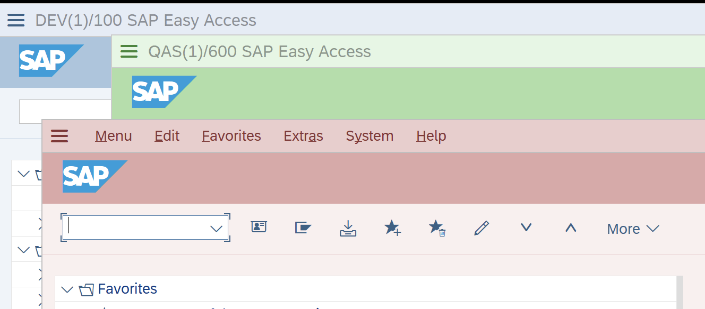
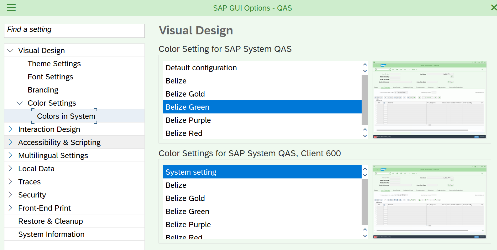
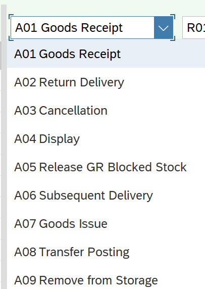
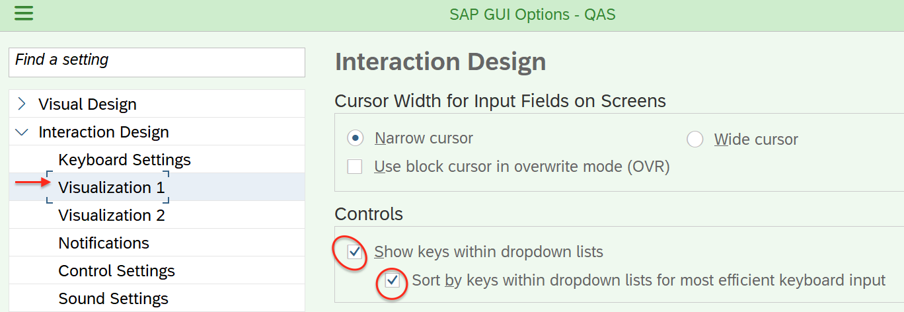
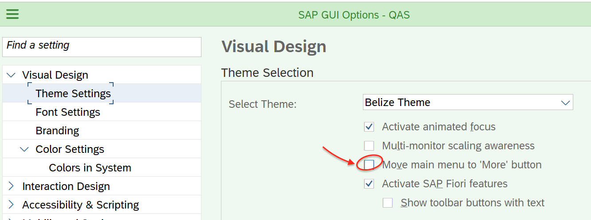

# SAPGUI / SAP Logon tips — colors, settings, shortcuts

SAP Logon has the ability to color different systems/clients in different colors. This can be helpful when working with several systems, so as not to accidentally do something in the wrong system. For example, you can color the DEV system blue, QAS green, PRD red, etc.

How to do it: Go to the settings in SAP Logon

Next, select the desired color for the system as a whole (on a top) or for the system + client (bottom)

Apply settings and restart SAP Logon.

More useful settings:

Show key in drop-down lists, like this:

It is configured here:

For SAP Logon 760 you can return the buttons to the menu as they were before, this is done here:

You can also activate autofill (by pressing space) of values ​​in long fields, this can be done here:

Starting with version 750, SAP Logon does not have the ability to save login+password (if you do not have SSO), but you can create shortcuts (for WIN) like this:

`"C:\Program Files (x86)\SAP\FrontEnd\SAPgui\sapshcut.exe" XXX.XXX.XXX.XXX -user=USERNAME -pw=PASSWORD -system=SYS -Client=YYY -language=EN`