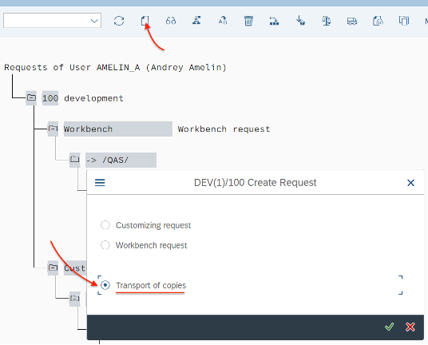
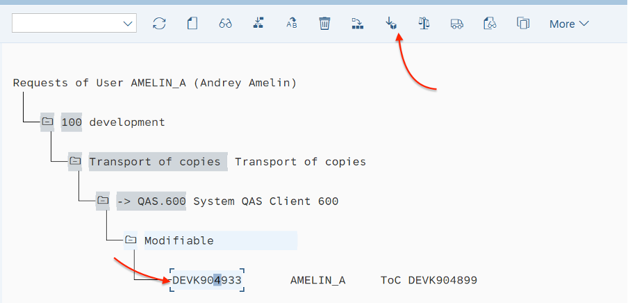
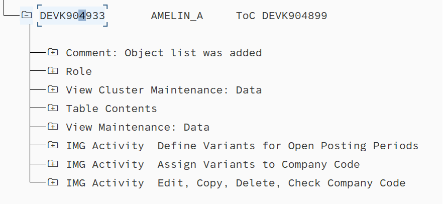

# Перенос запросов копиями (Transport of Copies)

Чтобы не деблокировать транспортные запросы для переноса в тестовую систему (QAS), можно воспользоватся функционалом Transport of copies

**Как это работает:**
1. Заходим в **SE10** или подобную транзакцию, создаем запрос, выбираем "Transport of copies"

2. Заполняем целевую систему (систему + мандант)

Сохраняем. Запрос появится в ветке "Transport of copies"

3. Ставим курсов на созданный запрос переноса копий и нажимаем "включить обьекты" (ctrl+F11)

4. Указываем запрос который нужно перенести

В запрос переноса копий добавятся объекты из целевого запроса:

5. Деблокируем запрос (F9) и переносим, при необходимости, в нужную систему (STMS, STMS_IMPORT итд)

