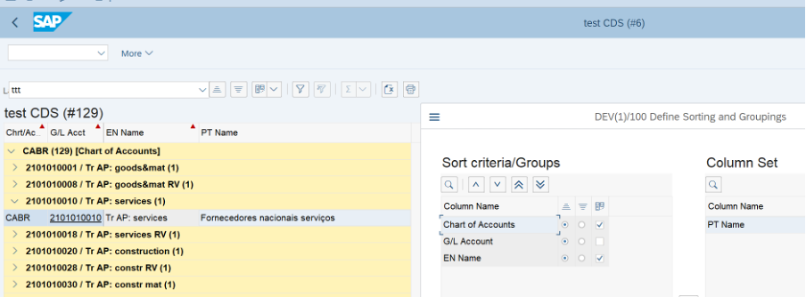

This post is about simple tutorial how to create own CDS view and show data via ALV IDA report.  
# What is CDS and how can they be useful?

CDS stands for **Core Data Services**. This is a functionality that allows you to create views of data using the **DDL (Data Definition Language)** language .  
  
In simple terms - you can create your own view based on SAP data table joins with additional logic for filling fields in this view.  
  
For example, take one table as the main source, enrich it with data from related tables (via joins/associations), and add logic to populate individual columns in the generated view. As a result, you'll get a view with the data you need and then work with it directly, for example, make selections in ABAP programs or visualizate through SAP tools, such as through ALV IDA or a custom FIORI application through odata services.  
  
> 💡 [Description of CDS from SAP](https://help.sap.com/docs/btp/sap-abap-cds-development-user-guide/abap-cds-entities?locale=en-US)  
  

# What is IDA aka ALV on HANA?

  
IDA is a data visualization tool in SAP GUI, stands for SAP List Viewer with **Integrated Data Access**. Also known as ALV on HANA.  
  
The main essence of the tool is that you can transfer the name of the CDS view and additional restrictions to it (rather than a preselected datas in internal table, as is the case with the classic ALV), the system will select the necessary data and display them in the form of a table visually similar to the ALV Grid, but more functional.  
  
Advantages of IDA:

- Building hierarchies, i.e. nested levels and subtotals over them
- All standard ALV functions are available (except editing and part of formatting)
- Great performance on big data (because it does not require prefetching all data)
- Ability to use text search
- Ability to add fields not from CDS (calculated fields)

  
The main differences between IDA and the classic ALV Grid:

||**SAP List Viewer**|**ALV with IDA**|
|---|---|---|
|Data Retrieval|Responsibility of application, data is collected in an internal ABAP table (ITAB)|Responsibility of ALV, table name has to be transferred|
|Data Contents|All data from the ITAB|Visible area only|
|Roundtrip (e.g. scrolling)|From ALV perspective only operations on the ABAP Server, new area from the ITAB is displayed|Paging on the database, that is, new SQL statement is executed|
|Application ALV Services (sorting, filtering…)|On the ITAB (snapshot behavior)|New call to the database|
|Memory Consumption|Depends on the size of the ITAB|Visible area only, relating to columns and rows|
|Speed|Time required for all data to be transferred to the ITAB on first display|Time required for visible area to be transferred|

> 💡 You may find more info here [https://help.sap.com/docs/SAP_NETWEAVER_AS_ABAP_FOR_SOH_740/b1c834a22d05483b8a75710743b5ff26/efeb734...](https://help.sap.com/docs/SAP_NETWEAVER_AS_ABAP_FOR_SOH_740/b1c834a22d05483b8a75710743b5ff26/efeb734c8e6f41939c39fa15ce51eb4e.html?version=7.40.29)  
  

# How it works?

## Prerequisites

- You must have a SAP S/4HANA system
- Installed [Eclipse](https://www.eclipse.org/downloads/) or VS code (here's an example with eclipse IDE)
- Eclipse has the ADT plugin installed, see [SAP Dev Tools](https://tools.eu1.hana.ondemand.com/)
- Eclipse configured to connect to SAP development system
- You want to make a report based on data from SAP using the new features of S/4HANA

> 💡 Useful links:  
> [Installing ABAP Development Tools](https://help.sap.com/doc/2e9cf4a457d84c7a81f33d8c3fdd9694/Cloud/en-US/inst_guide_abap_development_tools.pdf)  
> [Configuring the ABAP Back-end for ABAP Development Tools](https://help.sap.com/doc/2e65ad9a26c84878b1413009f8ac07c3/201909.001/en-US/config_guide_system_backend_abap_development_tools.pdf)  
  

## Creating a Simple CDS

Let's start creating a simple CDS. To do this, open Eclipse, select the system (the development system and the required client), go to Z package (it's convenient to add it to your favorites for quick access) and right-click on the package name and create a new object


Select **core data services->data definition**:


Specify the name of the new CDS:


And create a new transport request:


A template for a new CDS should appears:

``` abap
@AbapCatalog.sqlViewName: ''
@AbapCatalog.compiler.compareFilter: true
@AbapCatalog.preserveKey: true
@AccessControl.authorizationCheck: #CHECK
@EndUserText.label: 'test CDS'
define view ZVFI_TEST as select from data_source_name
association [1] to target_data_source_name as _association_name
    on $projection.element_name = _association_name.target_element_name {
    _association_name // Make association public
}
```

  
let's make a CDS view with data on the chart of accounts (CoA) and GL account texts in two languages ​​at once. Those we need standard SAP tables:  

- `SKA1` - GL account data
- `SKAT` - text table

The tables are connected by the fields `ktopl` and `saknr`. In `skat` there is also a `spra`s key field with a language for texts.  
  
And the final table should be, with columns:  
  
- CoA Chart of accounts (`SKA1-KTOPL`)
- GL Account number (`SKA1-SAKNR`)
- English account text (`SKAT-TXT50` where `SPRAS = EN`)
- Portuguese account text (`SKAT-TXT50` where `SPRAS = PT`)

First, let's set the CDS name for the ABAP repository (sqlViewName), by this name it will be possible to access the view, for example, via se16n/h. To do this, fill it in the first line at CDS:

``` abap
@AbapCatalog.sqlViewName: 'ZVRFI_TEST'
```

Next, add join conditions for tables `SKA1` and `SKAT` and define the fields we need in perspective, first for the English language in `SAKT`, it should look something like this:

``` abap
define view ZVFI_TEST as select from SKA1
association [1..1] to skat as _skat_en 
    on ska1.ktopl = _skat_en.ktopl
    and ska1.saknr = _skat_en.saknr
    and _skat_en.spras = 'E'
{
    key SKA1.ktopl as Ktopl,
    key SKA1.saknr as Saknr,
    _skat_en.txt50
}
```

Let's activate our CDS and check how it works. You can check in two ways:  
  

1. Directly in Eclipse, press **F8** and see the result:


2. Go to SAP GUI and run `se16`, `se16n`, `se16h` etc.


Once you made sure that everything works, let's add the texts in Portuguese at CDS view:

``` abap
define view ZVFI_TEST as select from ska1
association [1..1] to skat as _skat_en 
    on ska1.ktopl = _skat_en.ktopl
    and ska1.saknr = _skat_en.saknr
    and _skat_en.spras = 'E'
association [1..1] to skat as _skat_pt 
    on ska1.ktopl = _skat_pt.ktopl
    and ska1.saknr = _skat_pt.saknr
    and _skat_pt.spras = 'P'
{
    key ska1.ktopl as Ktopl,
    key ska1.saknr as Saknr,
    _skat_en.txt50 as en_txt50,
    _skat_pt.txt50 as pt_txt50
}
```

Let's check the result:


Everything is working fine. For a simple example, let's stop here and move on to data visualization using IDA. 

> 💡 You can read more about the possibilities of CDS [here.](https://help.sap.com/docs/btp/sap-abap-cds-development-user-guide/abap-cds-entities?locale=en-US)

## Creating a CDS-Based Report Using IDA

Let's create a new program in `se38`. At the custom program just call method `create_for_cds_view->fullscreen->display` in the class `CL_SALV_GUI_TABLE_IDA` ,change the name of CDS in the `iv_cds_view_name` parameter, i.e. So, just one line of code:

``` abap
REPORT ZFI_TEST_CDS.

cl_salv_gui_table_ida=>create_for_cds_view( iv_cds_view_name = 'ZVFI_TEST' )->fullscreen( )->display( ).
```

Activate and run the report (**F8**)


Everything works, data from CDS view is displayed in the report.  

Usually, however, also needed a selection screen, where users could specify some restrictions. In this example, let the selection fields be:  

- CoA Chart of Accounts (`SKA1-KTOPL`)
- GL Accounts (`SKA1-SAKNR`)

To do this, add to the program a block with a selection screen and these fields

``` abap
TABLES: ZVRFI_TEST.
SELECT-OPTIONS so_ktopl FOR ZVRFI_TEST-ktopl.
SELECT-OPTIONS so_saknr FOR ZVRFI_TEST-saknr.
```

And pass the restrictions from the selection screen to IDA:

``` abap
REPORT ZFI_TEST_CDS.
TABLES: ZVRFI_TEST.

SELECT-OPTIONS so_ktopl FOR ZVRFI_TEST-ktopl.
SELECT-OPTIONS so_saknr FOR ZVRFI_TEST-saknr.

START-OF-SELECTION.
  DATA(o_ida) = cl_salv_gui_table_ida=>create_for_cds_view( iv_cds_view_name = 'ZVFI_TEST' ).
  "Copy restrictions from selection screen
  DATA(o_sel) = NEW cl_salv_range_tab_collector( ).
  o_sel->add_ranges_for_name( iv_name = 'KTOPL' it_ranges = so_ktopl[] ).
  o_sel->add_ranges_for_name( iv_name = 'SAKNR' it_ranges = so_saknr[] ).
  o_sel->get_collected_ranges( IMPORTING et_named_ranges = DATA(lt_sel_crit) ).
  o_ida->set_select_options( it_ranges = lt_sel_crit ).
  "Show IDA
  o_ida->fullscreen( )->display( ).
``` 

As a result - the selection screen at will be:


Report results:


Now the reports seems fine. But, since using new tools, let's add some beauty to the report:  
  
- Rename columns for texts
- Add a quick selection of options (layout)
- Add a Layout Selection to the Selection Screen
- Add full-text search by account name
- Add a hotspot to the master account data (tr. **FSP0** )

``` abap
*&---------------------------------------------------------------------*
*& Report ZFI_TEST_CDS
*&---------------------------------------------------------------------*
*&
*&---------------------------------------------------------------------*

REPORT ZFI_TEST_CDS.
TABLES: ZVRFI_TEST.

SELECT-OPTIONS so_ktopl FOR ZVRFI_TEST-ktopl.
SELECT-OPTIONS so_saknr FOR ZVRFI_TEST-saknr.

"Add layout field to selection screen
PARAMETERS: p_layout TYPE if_salv_gui_layout_persistence=>y_layout_name.

**********************************************************************
CLASS lcl_event_handler DEFINITION .
  PUBLIC SECTION .
    METHODS:
      handle_hot_spot FOR EVENT cell_action OF if_salv_gui_field_display_opt
        IMPORTING ev_field_name
                  eo_row_data.
  PRIVATE SECTION.
ENDCLASS.
**********************************************************************
CLASS lcl_event_handler IMPLEMENTATION .
  METHOD handle_hot_spot.
    DATA: ls_wa TYPE ZVRFI_TEST.
    TRY.
        eo_row_data->get_row_data(
              EXPORTING iv_request_type = if_salv_gui_selection_ida=>cs_request_type-all_fields
              IMPORTING es_row          =  ls_wa ).
*        Hotspot actions
        CASE ev_field_name.
          WHEN 'SAKNR'.
            SET PARAMETER ID 'SAK' FIELD ls_wa-saknr.
            SET PARAMETER ID 'KPL' FIELD ls_wa-ktopl.
            CALL TRANSACTION 'FSP0'.
          WHEN OTHERS.
        ENDCASE.
      CATCH cx_salv_ida_contract_violation
              cx_salv_ida_sel_row_deleted.
    ENDTRY.
  ENDMETHOD.
ENDCLASS .

INITIALIZATION.
 DATA ls_persistence_key TYPE if_salv_gui_layout_persistence=>ys_persistence_key.
 ls_persistence_key-report_name = sy-repid.

AT SELECTION-SCREEN ON VALUE-REQUEST FOR p_layout.
  cl_salv_gui_grid_utils_ida=>f4_for_layouts( EXPORTING is_persistence_key = ls_persistence_key
                                              IMPORTING es_selected_layout = DATA(ls_selected_layout) ).
  p_layout = ls_selected_layout-name.

START-OF-SELECTION.
  DATA(o_ida) = cl_salv_gui_table_ida=>create_for_cds_view( iv_cds_view_name = 'ZVFI_TEST' ).
  "Copy restriction from selection screen
  DATA(o_sel) = NEW cl_salv_range_tab_collector( ).
  o_sel->add_ranges_for_name( iv_name = 'KTOPL' it_ranges = so_ktopl[] ).
  o_sel->add_ranges_for_name( iv_name = 'SAKNR' it_ranges = so_saknr[] ).
  o_sel->get_collected_ranges( IMPORTING et_named_ranges = DATA(lt_sel_crit) ).
  o_ida->set_select_options( it_ranges = lt_sel_crit ).
  "Adjust column names
  o_ida->field_catalog( )->set_field_header_texts( iv_field_name    = 'EN_TXT50' iv_header_text   = 'EN Name' ).
  o_ida->field_catalog( )->set_field_header_texts( iv_field_name    = 'PT_TXT50' iv_header_text   = 'PT Name' ).
  "Turn on text search feature
  o_ida->standard_functions( )->set_text_search_active( abap_true ).
  o_ida->field_catalog( )->enable_text_search( 'EN_TXT50' ).
  o_ida->field_catalog( )->enable_text_search( 'PT_TXT50' ).
  "Turn on layouts
  o_ida->layout_persistence( )->set_persistence_options( is_persistence_key = VALUE #( report_name = sy-repid )
                                                         i_global_save_allowed = abap_true
                                                         i_user_specific_save_allowed = abap_true ).
  o_ida->toolbar( )->enable_listbox_for_layouts( ). "turn on dropdown layout list
  if p_layout is not initial. "set layout from selection screen
    try.
         o_ida->layout_persistence( )->set_start_layout( p_layout ).
      catch cx_salv_ida_unknown_name.
        message i000(0k) with |Layout { p_layout } unknown - continue w/o start| | layout...|.
    endtry.
  endif.
  "Hotspot handler
  TRY.
    DATA: gr_event_handler TYPE REF TO lcl_event_handler.
    CREATE OBJECT gr_event_handler.
    o_ida->field_catalog( )->display_options( )->display_as_link_to_action( 'SAKNR' ).
    SET HANDLER gr_event_handler->handle_hot_spot FOR o_ida->field_catalog( )->display_options( ).
  CATCH cx_salv_ida_unknown_name cx_salv_call_after_1st_display.
  ENDTRY.
  "Show IDA
  o_ida->fullscreen( )->display( ).
```

The result is - the regular selection screen (I've only added a field with layouts):


In the report itself, the columns were renamed and new functions appeared:


**Compared to classic ALV:**  
  
- Text search (two mechanisms: exact search and fuzzy search), field for searching here:


- A quick selection of layouts, a drop-down list with pre-saved layouts appears in the toolbar at the top (I've saved the layouts "ttt" and "ttt2"):


> 💡In some SAP versions there is a bug with a layot saving options, it can be solved by implementing SAP OSS note [**3196994** - "IDA-ALV - ALV Layout not being saved"](https://me.sap.com/notes/3196994/E)  
  
- Grouping functionality (in my opinion this is a very helpful)


With it, you can build any hierarchies in a reports (several fields at once), make subtotals, etc. As an example of a two-level hierarchy, the first level is the chart of accounts, the second level is the GL account and its EN text (through a slash"/"):



> 💡 You can read more about IDA [here](https://help.sap.com/doc/saphelp_nw74/7.4.16/en-us/ef/eb734c8e6f41939c39fa15ce51eb4e/frameset.htm) and find in the SAP system examples of programs `SALV_IDA*`