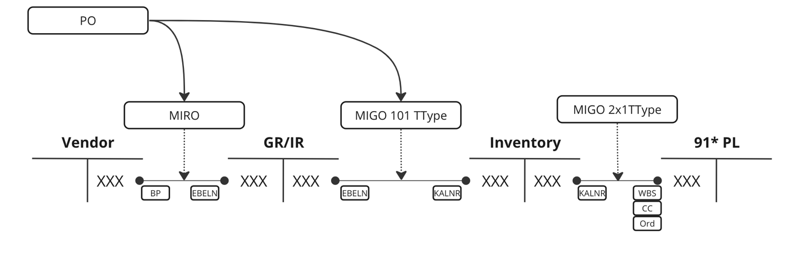
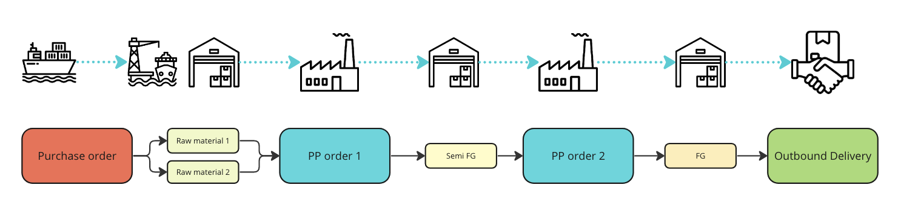
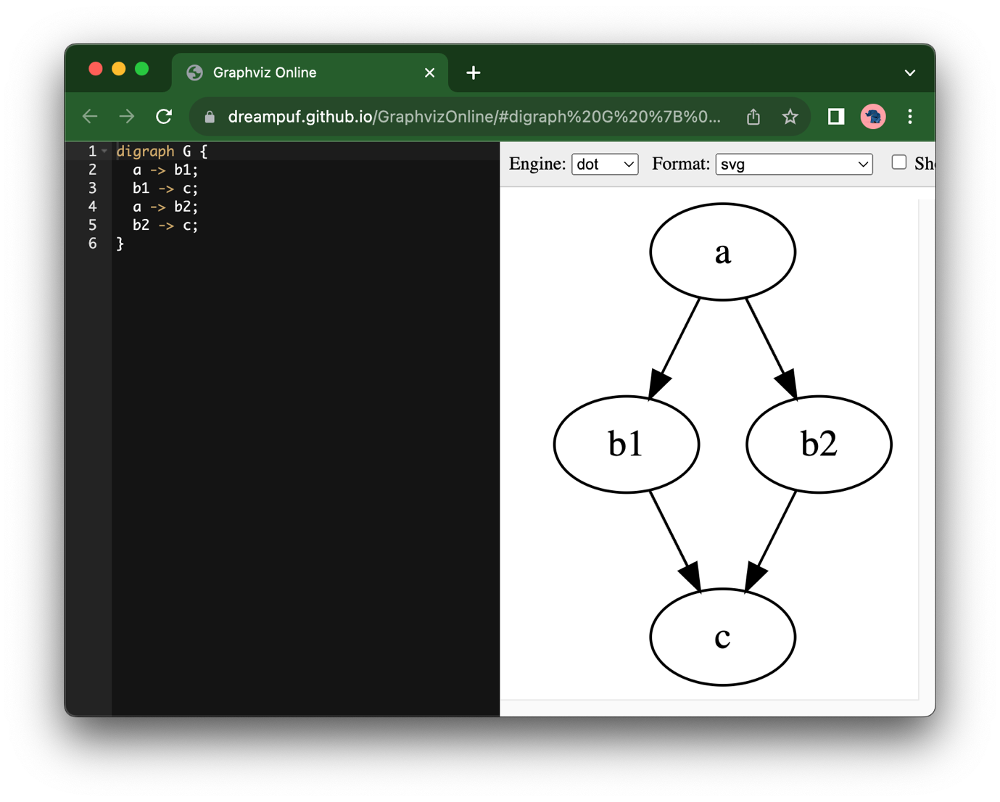
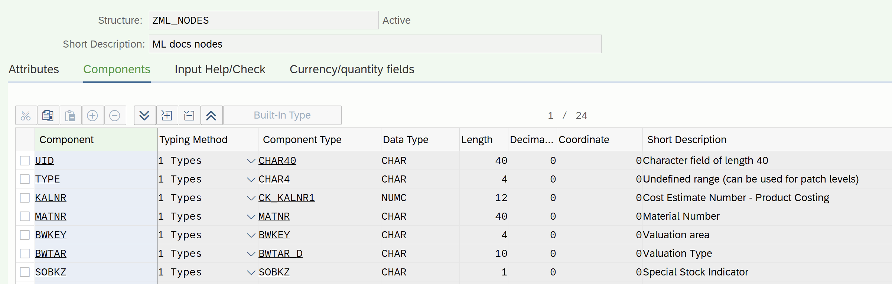
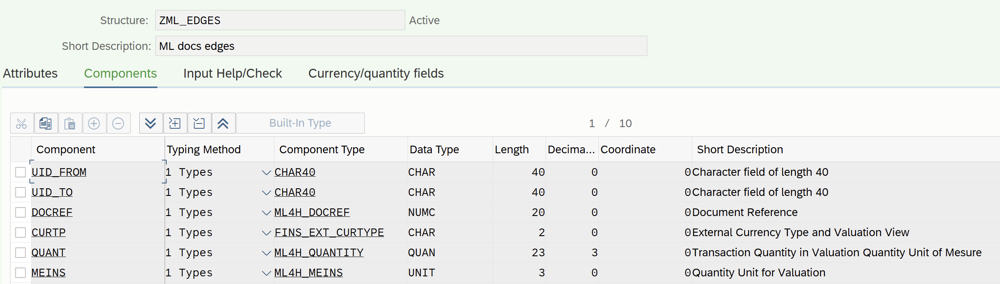
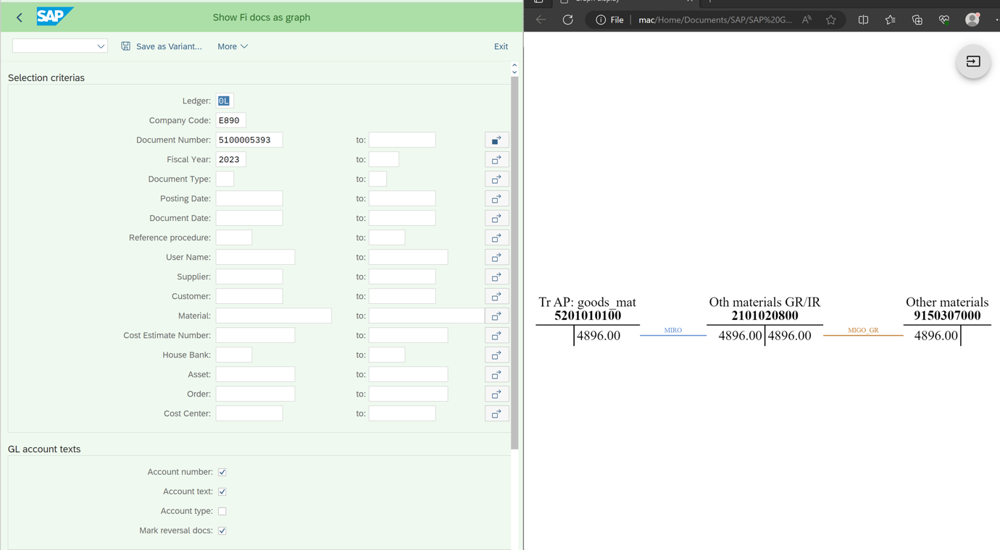
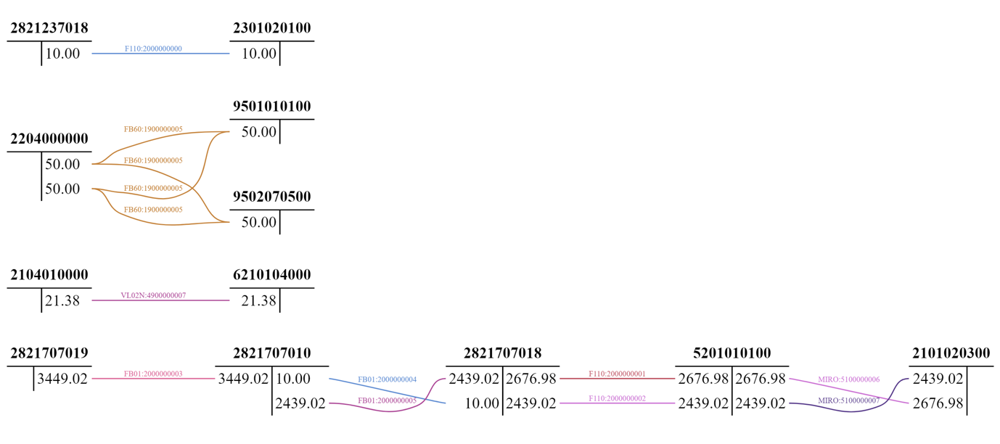
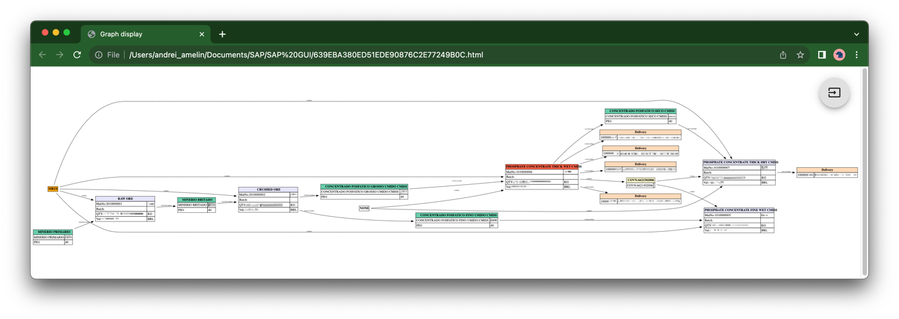
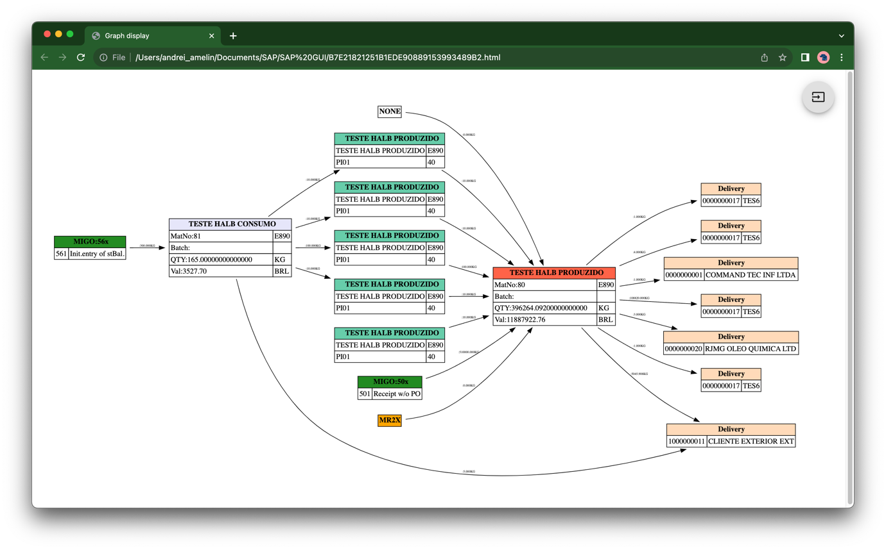

# 02 Graphs. Another way to show SAP ERP data

> SAP Community: https://community.sap.com/t5/technology-blogs-by-members/graphs-another-way-to-show-sap-erp-data/ba-p/13580803

---

**Existing visualisation tools at SAP**


How typical SAP report looks like? Like a table with a lot of data or list of entries. Usually, table-like visualisation functionality using to represent data, such as:

- Classic **ALV Grid/List** - to show transparent table data
- Modern ALV, like **IDA**, **PIVB** etc - for tables
- **ALV hierarchy, ALV tree** - to show hierarchy related data
- **FIORI** tools to display tables (**design studio**, lists etc) - for tables too
All these tools are great for displaying table data, but sometimes SAP data is not a table structured, so, it's hard to display this kind of data via these tools.

**Non table-like types of SAP data**


For example, I think a lot of us make a lot of diagrams with explanation of the business processes with accounts postings as a **T-accounting view**, like this:





Another example - visualisation of **production processes** like chain of:

materials->PP orders->semi-finished goods->another PP order->finish good->sales

Like this:





All these data are impossible (or really hard) to represent by table view. Also, existing SAP tools (like FIORI lighthouse app ["Display Journal Entries in T-Account View"](https://fioriappslibrary.hana.ondemand.com/sap/fix/externalViewer/index.html) or [SAP Graph](https://help.sap.com/docs/graph)) are not so helpful in some cases.So, I think to show these kind of data I should use another approach for visualisation, like, for example Graphs at SAP GUI (SAPLogon) interface.

**What is Graphs?**


**Graph** is a structure amounting to a [set](https://en.wikipedia.org/wiki/Set_(mathematics)) of objects in which some pairs of the objects are in some sense "related". The objects correspond to mathematical abstractions called [vertices](https://en.wikipedia.org/wiki/Vertex_(graph_theory)) (also called nodes or points) and each of the related pairs of vertices is called an edge (also called link or line).[[1]](https://en.wikipedia.org/wiki/Graph_(discrete_mathematics)) Typically, a graph is depicted in [diagrammatic form](https://en.wikipedia.org/wiki/Diagrammatic_form) as a set of dots or circles for the vertices, joined by lines or curves for the edges.

Here's a good explanation [Wikipedia. Graph (discrete mathematics)](https://en.wikipedia.org/wiki/Graph_(discrete_mathematics))

**How Graphs can be stored and visualised?**


To show Graphs I will use [graphviz](https://graphviz.org/) solution.


Graphviz is **open source** graph visualization software. Graph visualization is a way of representing structural information as diagrams of abstract graphs and networks.


Just to understand how Graphviz works. I can create a HTML file with simple structure of Nodes and Edges like this:

```abap
digraph G {
  a -> b1;
  b1 -> c;
  a -> b2;
  b2 -> c;
}
```


And open this HTMS file at any browser to get a visualisation:





To store Graph data I'll use a simplest approach - store all nodes and edges at two tables. Another options of storing graph data you may find [here](https://medium.com/@siddarthsiddhu58/graph-storage-technique-7d32861956f0)


**Technical realisation of graphs at ABAP**


**How to store graph as an internal table**


To store Graph data at SAP I used a two internal tables:

- First one to store **Nodes (or vertices)**. Here should be a unique node ID and some node attributes

| **Node ID (key)** | **Name** | **Other attributes** |
|---|---|---|
| ID 1 | Node one | Color, values, texts etc |
| ID 2 | Node two | ... |


- Second one - for **Edges**. Here's a info for relationship between Nodes and additional Edge attributes

| **Node From (key)** | **Node to (key)** | **Edge attributes** |
|---|---|---|
| ID 1 | ID 2 | Texts, amounts, color etc |


**Class to create HTML file of graph**


Solution for working with Graphviz at ABAP has been developed by [github marcellourbani/abapgraph](https://github.com/marcellourbani/abapgraph)

I'll use this one, you can install it to your system via **ABAPGit** or manually (link above).

Simple example how it works:

a) Create a Node structure via **se11**





b) Create a Edge structure via **se11**





c) Create a report, select necessary data into two internal tables lt_nodes[] (with p.a structure) and lt_edges[] (with p.b structure), and create a Graph, like this:

```abap
*Create Graph
graph = zcl_abap_graph=>create( ).
*Add Nodes
zcl_abap_graph_node_record=>create(...)
*Add Edges (links)
<Node from>-cl->linkto( destination = <Node to> label = ... ).
*Output as HTML file in browser
zcl_abap_graph_utilities=>show_in_browser( graph ).
```


More details:

```abap
TYPES: BEGIN OF t_edge,
           uid TYPE zml_nodes-uid,
           cl  TYPE REF TO zcl_abap_graph_node_record,
         END OF t_edge.

DATA: graph       TYPE REF TO zcl_abap_graph,
      lt_nodes    LIKE SORTED TABLE OF zml_nodes WITH NON-UNIQUE KEY uid,
      lt_edges    LIKE STANDARD TABLE OF zml_edges, 
      gv_html_viewer TYPE REF TO cl_gui_html_viewer,
      cellattrs      TYPE REF TO zcl_abap_graph_attr,
      lt_cl_e        TYPE STANDARD TABLE OF t_edge,
      ls_cl_e        LIKE LINE OF lt_cl_e.
...
*add selection screen
...
*select data into lt_nodes[] and lt_nodes[]
...
*Graph output
TRY.
 graph = zcl_abap_graph=>create( ).
**********************************************************************
*Nodes
 LOOP AT lt_nodes ASSIGNING FIELD-SYMBOL(<nodes>).
        ls_cl_e-uid = <nodes>-uid.
        ls_cl_e-cl = zcl_abap_graph_node_record=>create( 
                     id = |{ <nodes>-uid }| 
                     label =  <nodes>-text_h 
                     graph = graph 
                     escape = abap_false ).
        cellattrs = zcl_abap_graph_attr=>create( abap_true ).
        cellattrs->set( name = 'ALIGN' value = 'left' ).
        CASE  <nodes>-type.
          WHEN  'KALN'. "Materials
            ls_cl_e-cl->addcomponent( 
                     name = 'MatNo:' && |{ <nodes>-matnr ALPHA = OUT }| 
                     value = |{ <nodes>-bwkey }| 
                     nameattributes = cellattrs 
                     valueattributes = cellattrs ).
            ls_cl_e-cl->headerattr->set( name = 'bgcolor' value = pc_KALNC ).
         WHEN 'CORD'. "Co orders
            ls_cl_e-cl->headerattr->set( 
                     name = 'bgcolor' 
                     value = pc_CORD ).
            ls_cl_e-cl->addcomponent( 
                     name =  |{ <nodes>-ktext }| 
                     value = |{ <nodes>-bwkey }| 
                     nameattributes = cellattrs 
                     valueattributes = cellattrs ).
... "Add other Node types
      ENDCASE.
    APPEND ls_cl_e TO lt_cl_e.
  ENDLOOP.
**********************************************************************
*Edges
      LOOP AT lt_edges ASSIGNING FIELD-SYMBOL(<edges>).
        CHECK <edges>-uid_from IS NOT INITIAL.
        CHECK <edges>-uid_to IS NOT INITIAL.
        READ TABLE lt_cl_e ASSIGNING FIELD-SYMBOL(<from>) WITH KEY uid = <edges>-uid_from.
        READ TABLE lt_cl_e ASSIGNING FIELD-SYMBOL(<to>) WITH KEY uid = <edges>-uid_to.
        <to>-cl->linkto( 
                 destination = <from>-cl->id 
                 fontsize = '6' 
                 label = |{ <edges>-tcode  && ':' && <edges>-quant && <edges>-meins }| ).
        UNASSIGN: <to>, <from>.
      ENDLOOP.
**********************************************************************
    zcl_abap_graph_utilities=>show_in_browser( graph ).
  CATCH cx_root INTO ex.
    MESSAGE 'Error' TYPE 'I'.
ENDTRY.
```

**Converting SAP data into a graph**


To convert table stored SAP data into Graph, I've used a approach with recursive selection of data. For example, if you need to find all chain of materials (let's call it CostEst -KALNR) and they movements - you may analyse MATDOC table by KALNR field, find all related KALNRs (at field KALNR_CG) and perform again a selection for each found KALNR_CGs as KALNR (and doing it till new KALNR_CG still exist).

**Examples how it works at SAP**


**Case 1. Accounting postings as a T-view**


This program selects all FI related data (from ACDOCA etc) and creates a GL accounts as a Nodes and postings as an Edges (based on acdoca-gkont info). As a result - FI documents shows as a T-view accounting entries:





or more complex case with more docs:





**Case 2. Production process**


This is a program for ML (material ledger) data analysing. Here I selects all ML related data (MLDOC etc) by CostEst numbers and recursive selects all chains of material, CO orders etc. As a result i have here a full list of the production processes.
Legend for the colors below:

- Aquamarine - CO orders
- Lavender - Materials (CostEst)
- Tomato - Material (selection criteria)
- Peach - Outbound Deliveries
- Orange - material revaluation
- Green - Goods receipts




or like this:




