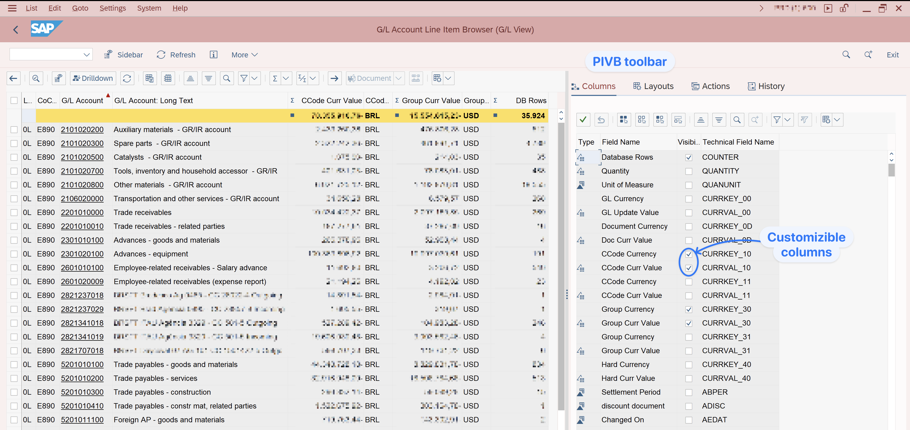
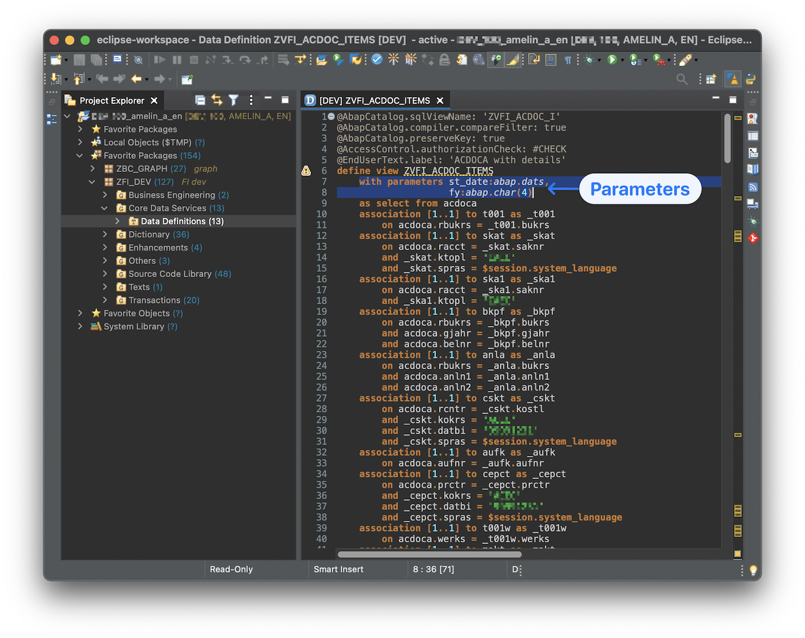
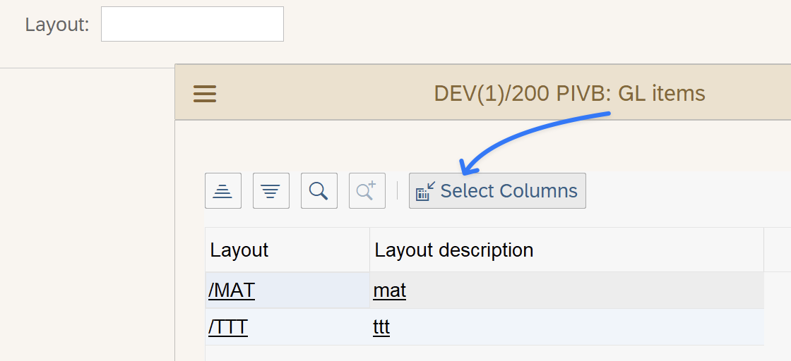
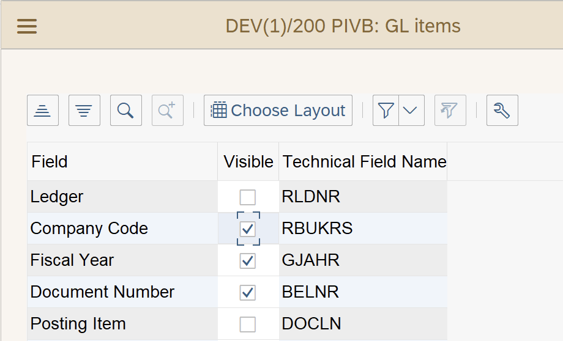
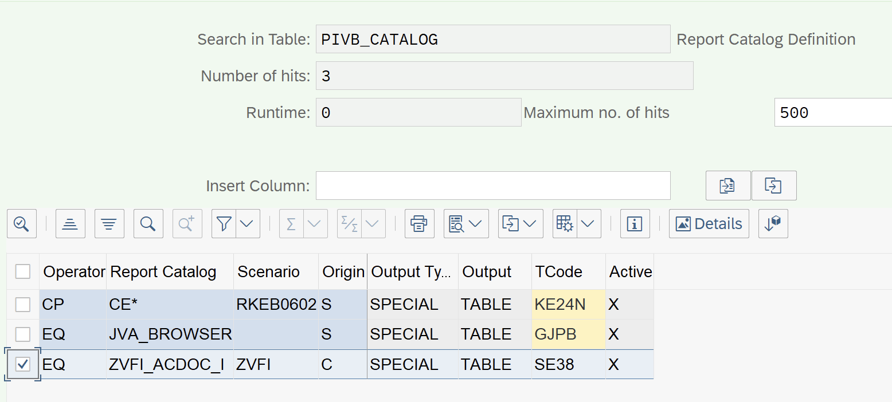
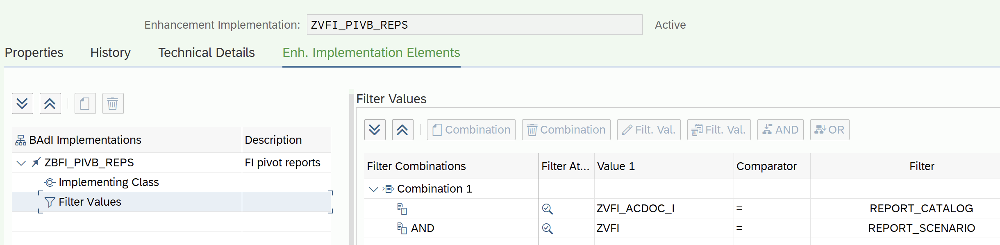
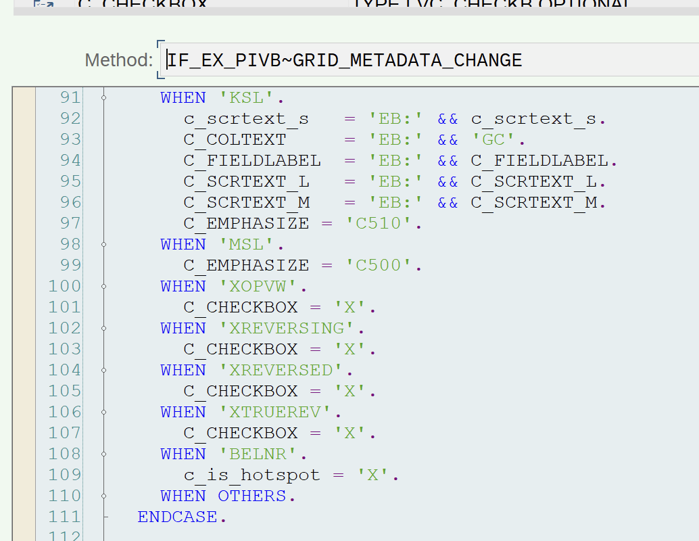
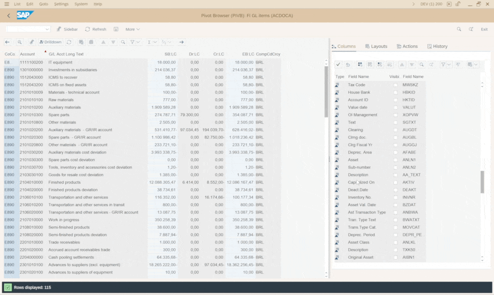

# 03 Tutorial. Custom PIVB ALV report based on a CDS with parameters

> SAP Community: https://community.sap.com/t5/technology-blogs-by-members/tutorial-how-to-create-custom-pivb-alv-report-based-on-a-cds-with/ba-p/13581331

---

This post is about a simple tutorial how to create own ALV PIVB report based on data from own custom CDS with input parameters.

**What is PIVB reports?**


PIVB reports allows you to generate reports (totals or items report) and add analytics (i.e. columns) to the report on the fly. While adding columns - system recalculates the data in the report, i.e. the number of rows may changes. In simple words, it works in the same way as the PivotTable mechanism in MS Excel. For example, you can see standard SAP reports such as **FAGLL03H**, **FBL1H**, etc.

These reports can be identified by the presence of a sidebar on the right (it can be moved to the left), and the new layout mechanism for working with reports, which allows you to generate a set of columns on the fly (ad-hoc).

An example of a report (**FAGLL03h**😞





Description from SAP and technical details you may find in SAP note [2100879](https://launchpad.support.sap.com/)

**How to create own PIVB report**


Here's a simple step-by-step guide how to create a PIVB report

**CDS with data**


You need a table or CDS with data for the report. In the example below, I will use Z CDS (based on ACDOCA) with input parameters (fiscal year and start date):





**Create a custom report**


Create a custom program for the report (for example, you can use the **RFPIVB_EX_SFLIGHT_01** report as a reference). In the program, specify selection screen:

```abap
REPORT zfi_glrep_items_pivb.
TABLES: zvfi_acdoc_i.

SELECTION-SCREEN BEGIN OF BLOCK bl1 WITH FRAME TITLE TEXT-001.
  SELECT-OPTIONS: so_rldnr FOR zvfi_acdoc_i-rldnr NO INTERVALS DEFAULT '0L',
                  so_bukrs FOR zvfi_acdoc_i-rbukrs MEMORY ID buk,
                  so_gjahr FOR zvfi_acdoc_i-gjahr OBLIGATORY no-EXTENSION NO INTERVALS DEFAULT sy-datum+0(4),
                  so_budat FOR zvfi_acdoc_i-budat OBLIGATORY NO-EXTENSION,
                  so_racct FOR zvfi_acdoc_i-racct,
                  so_KTOKS FOR zvfi_acdoc_i-ktoks,
                  so_LOKKT FOR zvfi_acdoc_i-lokkt,
                  so_koart FOR zvfi_acdoc_i-koart.
SELECTION-SCREEN END OF BLOCK bl1.

SELECTION-SCREEN BEGIN OF BLOCK bl2 WITH FRAME TITLE TEXT-002.
  PARAMETERS: p_sb AS CHECKBOX.
  PARAMETERS: p_disvar TYPE  slis_vari MODIF ID p_d.
SELECTION-SCREEN END OF BLOCK bl2.
```


Add processing of the layouts (field P_DISVAR) search help:

```abap
AT SELECTION-SCREEN ON VALUE-REQUEST FOR p_disvar.
* service FM PIVB_F4
  CALL FUNCTION 'PIVB_F4'
    EXPORTING
      i_report_catalog  = con_catalog
      i_report_scenario = con_scenario
    IMPORTING
      e_layout          = p_disvar
      e_result_status   = g_result_status
      e_layout_name     = g_layout_name
    CHANGING
      ct_field          = gt_column
    EXCEPTIONS
      error_message     = 4.
  IF sy-subrc = 4.
    "Do nothing, same error will be also raised during execution
    "(and is not possible raise messages in F4 Help event)
  ENDIF.

* update screen with description of the selected layout
  IF g_result_status = if_pivb_c_f4=>result_field.
    MESSAGE i014(pivb) INTO g_txt.
    g_layout_name = g_txt.
    MESSAGE i013(pivb) INTO g_txt.
    PERFORM update_screen.
  ELSEIF g_result_status = if_pivb_c_f4=>result_layout.
    MESSAGE i012(pivb) INTO g_txt.
    PERFORM update_screen.
  ENDIF.


FORM update_screen.
  DATA:
    ls_dynpfield TYPE dynpread,
    lt_dynpfield TYPE TABLE OF dynpread.

  CLEAR: lt_dynpfield[], ls_dynpfield.

  ls_dynpfield-fieldname = 'P_DISVAR'.
  ls_dynpfield-fieldvalue = p_disvar.
  APPEND ls_dynpfield TO lt_dynpfield.

  CALL FUNCTION 'DYNP_VALUES_UPDATE'
    EXPORTING
      dyname     = sy-repid
      dynumb     = sy-dynnr
    TABLES
      dynpfields = lt_dynpfield.
ENDFORM.
```


PIVB ALV layouts search help, with **ad-hoc** functionality, looks like:








 

And at the main part of the report - add a transfer data from the selection screen to the PIVB functionality (via FM **PIVB_CONV_RANGE_TO_SELTAB**)

```abap
* convert the entered values into standard PIVB format
  PERFORM convert_to_seltab USING 'RBUKRS' so_bukrs[]  CHANGING gt_seltab.
  PERFORM convert_to_seltab USING 'RLDNR' so_rldnr[]  CHANGING gt_seltab.
  PERFORM convert_to_seltab USING 'BUDAT' so_budat[]  CHANGING gt_seltab.
  PERFORM convert_to_seltab USING 'RACCT' so_racct[]  CHANGING gt_seltab.
  PERFORM convert_to_seltab USING 'KTOKS' so_KTOKS[]  CHANGING gt_seltab.
  PERFORM convert_to_seltab USING 'LOKKT' so_LOKKT[]  CHANGING gt_seltab.
  PERFORM convert_to_seltab USING 'KOART' so_koart[]  CHANGING gt_seltab.

FORM convert_to_seltab USING
                         us_fname   TYPE rsdstabs-prim_fname
                         fs_table   TYPE ANY TABLE
                       CHANGING
                         ct_seltab  TYPE rsds_frange_t.
  CALL FUNCTION 'PIVB_CONV_RANGE_TO_SELTAB'
    EXPORTING
      i_fname   = us_fname
      it_table  = fs_table
    CHANGING
      ct_seltab = ct_seltab.
ENDFORM.
```


Let's declare constants with the name of the report, they will need to be registered in the PIVB customizing tables and in the **BAdI PIVB**implementation, it will be further at post

```abap
CONSTANTS con_catalog         TYPE pivb_report_catalog  VALUE 'ZVFI_ACDOC_I'.
CONSTANTS con_scenario        TYPE pivb_report_scenario VALUE 'ZVFI'.
```


And call the main FM **PIVB_CONV_RANGE_TO_SELTAB**to retrieve data and show the PIVB ALV report

```abap
* call the main PIVB FM with all necessary parameters
  CALL FUNCTION 'PIVB_SELECT_AND_DISPLAY'
    EXPORTING
      i_report_catalog     = con_catalog
      i_report_scenario    = con_scenario
      it_seltab            = gt_seltab
      i_layout             = p_disvar
      it_column_visibility = gt_column
      it_param             = lt_par.
```


Thats it with the report. But, also, customizing and PIVB BAdI implementation needed.

**Customizing**


There are 4 main customizing tables:

- **PIVB_CATALOG**Report catalogs
- **PIVB_FEATURE** Pivot Browser features
- **PIVB_FIELD** Fieldcatalog data
- **PIVB_FIELDMAP** Field Mapping

For a simple example, it is enough to define our report only in **PIVB_CATALOG** (via **SM30**😞




**Implement PIVB BAdI**


Next, let's create an implementation of the PIVB enhancement point (**se18/19**), there is a standard template of implementation - **SAP_SFLIGHT_01.**Let's create own implementation and specify the values from **PIVB_CATALOG**customizing into the BAdI implementation filter:





For a simple report, it's only need to implement the IF_EX_PIVB~**SELECT**method in which I override the data selection mechanism for example, it will be like this:

```abap
method if_ex_pivb~select.
  data lt_trange                  type rsds_trange.
  data lt_trange_and              type pivb_trange_t.
  data lt_select                  type standard table of string.
  data lt_group_by                type standard table of string.
  data lt_group_by_checked        type standard table of string.
  data lt_field_mapping           type pivb_fieldmap_short_t.
  data l_column                   type string.
  data l_tabname                  type tabname.
  data oref                       type ref to cx_root.
  data lt_where                   type rsds_where_tab.
  field-symbols <fs_item>         type any.
  constants lc_tabname            type tabname  value 'ZVFI_ACDOC_I'.
  constants lc_devclass           type devclass value 'ZFI_DEV'. "package of the table

  me->get_security_metadata( i_report_catalog = i_report_catalog ).

  call function 'PIVB_SQL_GET_CLAUSE'
    exporting
      i_report_catalog            = i_report_catalog
      i_report_scenario           = i_report_scenario
      it_seltab                   = it_seltab
      it_and_seltab               = it_and_seltab
      it_column                   = it_column
      it_column_metadata          = it_column_metadata
      i_tabname                   = lc_tabname
      it_table_sec                = me->mt_secure_whitelist
      ut_fieldmap                 = lt_field_mapping
      I_STRICT_MODE               = 'X'
    importing
      et_select                   = lt_select
      et_group_by                 = lt_group_by
      et_trange                   = lt_trange[]
      et_trange_and               = lt_trange_and[].

  LOOP AT lt_select ASSIGNING FIELD-SYMBOL(<sel>).
    CHECK <sel>+0(4) = 'SUM('.
    REPLACE '(' in <sel> WITH `( `.
    REPLACE ')' in <sel> WITH ' )'.
  ENDLOOP.

**********************************************************************
  call function 'PIVB_CONV_RANGE_TO_WHERE'
    exporting
      it_trange           = lt_trange[]
      it_trange_and       = lt_trange_and[]
    importing
      et_where            = lt_where[].

* GROUP BY
  loop at lt_group_by into l_column.
    append l_column to lt_group_by_checked.
  endloop.
  free lt_group_by.

* DO SELECT
***********************************************************************
  DATA: st_date TYPE dats,
        fy TYPE gjahr.
  LOOP AT CT_PARAM ASSIGNING FIELD-SYMBOL(<fs_p>).
    CASE <fs_p>-PARAMNAME.
      WHEN 'ST_DATE'.
        st_date = <fs_p>-CUSTOM.
      WHEN 'FY'.
        fy = <fs_p>-CUSTOM.
      WHEN OTHERS.
    ENDCASE.
  ENDLOOP.
  try.
    select (lt_select)
      from ZVFI_ACDOC_ITEMS( st_date = @st_date,
                             fy = @fy )
      where (lt_where)
      group by (lt_group_by_checked)
      into corresponding fields of TABLE @ct_outtab.
  catch cx_sy_open_sql_db into oref.
    data: l_txt type string.
    l_txt = oref->get_text( ) ##MG_MISSING.
    message e017(pivb) with lc_tabname l_txt space space raising sql_error.
  endtry ##MG_MISSING.
endmethod.
```


Please note that to use the new query syntax, you need to set the parameter **I_STRICT_MODE = 'X'**and slightly adjust the functionality for filling the internal table lt_select (add spaces to the dynamic parameters of the query).

 

In the IF_EX_PIVB~**GRID_METADATA_CHANGE** method, you can change the ALV display parameters (fieldcatalog), for example, set own column header texts, colors, display options, as follows:





Activate the implementation of the enhancement, activate report etc. Everything done!

**How it works**


Adding columns to PIVB report:





