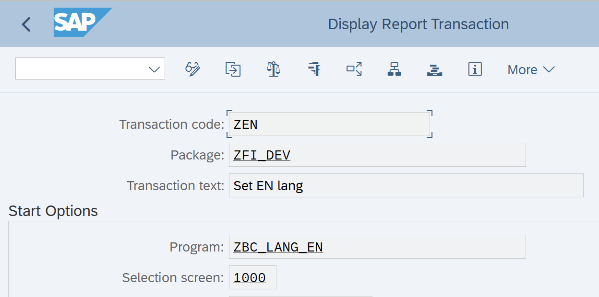

# 04 SAP Logon online language switcher

> SAP Community: https://community.sap.com/t5/technology-blogs-by-members/sap-logon-online-language-switcher/ba-p/13580754

---

**Problem**


When you working at international multi-language SAP project - you may need to perform testing a lot of functionality at SAP Logon in different languages. Standard SAP approach - to change SAP GUI (SAPLogon) language you need to log-off and log-on again with other language.

IMO, it takes a lot of time to perform a simple action to change language, so, let's try to make a simple functionality to save our time.

**Solution**


Concept - create a custom tcodes for online switching language. So, these tcodes should call ABAP program with functionality:

- Set locale language:
```abap
SET LOCALE LANGUAGE 'E'.
```

- Call a new session with new language via:
```abap
CALL FUNCTION 'ABAP4_CALL_TRANSACTION' STARTING NEW TASK 'LANGUAGE'
```

- Close the current session.
**Implementation example:**

- Create a new program, for example **ZBC_LANG**
```abap
REPORT ZBC_LANG.
CASE sy-tcode.
  WHEN 'ZEN'. SET LOCALE LANGUAGE 'E'.
  WHEN 'ZRU'. SET LOCALE LANGUAGE 'R'.
  WHEN 'ZPT'. SET LOCALE LANGUAGE 'P'.
* WHEN 'Zxx'. SET LOCALE LANGUAGE 'x'.
  WHEN OTHERS.
    exit.
ENDCASE.

CALL FUNCTION 'ABAP4_CALL_TRANSACTION' STARTING NEW TASK 'LANGUAGE'
  EXPORTING
    tcode = 'SESSION_MANAGER'.
```

- Create a list of transactions with names like Z<language> at **SE93**, for example **ZEN**, **ZPT**, **ZRU** etc.





**How it works**


Just put in tcode field "/nz<language>" (i.e. **/nzEN**, **/nzPT** etc).

System changes current language without logging-off.


Lang switcher

