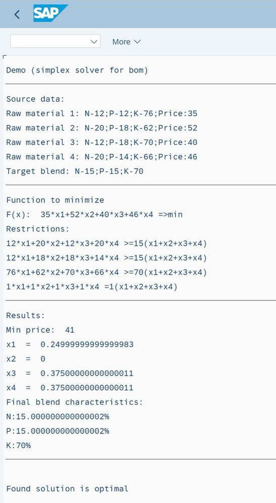

# 05 Linear programming in ABAP. Simplex method. Find optimized BOM

> SAP Community: https://community.sap.com/t5/technology-blogs-by-members/linear-programming-in-abap-simplex-method-find-optimised-bom/ba-p/13661302

---

This is a short post regarding linear programming (LP) and Simplex method in ABAP. I’ve tried to find some standard SAP functionality, but with no success (except a small demo program GENIOS_TEST_DEMO). Maybe I’m reinventing a wheel here, so, if somebody knows it – please let me know (maybe it could be part of PP, APO or IBP functionality).

Below you may find a simple basic description how some of LP problem can be solve via standard SAP class cl_genios_environment.


## What is LP?

Linear programming (LP), also called linear optimization, is a method to achieve the best outcome (such as maximum profit or lowest cost) in a mathematical model whose requirements and objective are represented by linear relationships. Linear programming is a special case of mathematical programming (also known as mathematical optimization).

Link to the WIKI [https://en.wikipedia.org/wiki/Linear_programming](https://en.wikipedia.org/wiki/Linear_programming)


# Example of optimization task. Creating an optimal BOM with necessary characteristics

As one of the optimisation task which can be solved by LP let’s take this one:

We need to create a some blend from raw materials with characteristics as shown below, with components percentage:

- N >=15%,
- P >=15%,
- K >=70%.
*N/P/K is a components of a material. These components also contain in a raw materials, but in a different components percentages.

| Raw material | N, % | P, % | K, % | Price per KG |
|---|---|---|---|---|
| Material 1 (x1) | 12 | 12 | 76 | 35 EUR |
| Material 2 (x2) | 20 | 18 | 62 | 52 EUR |
| Material 3 (x3) | 12 | 18 | 70 | 40 EUR |
| Material 4 (x4) | 20 | 14 | 66 | 46 EUR |

As an assumption – component percentage are mass based.

Requirements: find optimal (with less total price) bill of material (BOM) to create 1KG of this blend.

Let's create an economic-mathematical model of the problem:

Define as:
x1 – quantity of Material 1 in target blend, in kg
x2 – …Material 2, kg
x3 – …Material 3, kg
x4 – …Material 4, kg


Restriction of components percentages can be formalized as system of linear inequations :
12x1 + 20x2 + 12x3 + 20x4 ≥ 15(x1 + x2 + x3 + x4)
12x1 + 18x2 + 18x3 + 14x4 ≥ 15(x1 + x2 + x3 + x4)
76x1 + 62x2 + 70x3 + 66x4 = 70(x1 + x2 + x3 + x4)

Left side: percentage of N/P/K in raw materials multiply by quantity of raw materials in final blend

Right side: Target blend N/P/K characteristics


Restriction of total blend quantity should be equal to 1kg, let’s put it as an additional at the previous inequations
x1 + x2 + x3 + x4 = 1 (kg)

Final blend price function, which should be optimized is:
35x1 + 52x2 + 40x3 + 46x4  → min

This is a sum of price multiply by quantity of each raw material in target blend.


## How it can be solved in math way

Let's solve the linear programming problem using the dual simplex method and simplex tables.

[https://en.wikipedia.org/wiki/Simplex_algorithm](https://en.wikipedia.org/wiki/Simplex_algorithm)

Reduce the system of inequalities to a system of equations by introducing additional variables (x5 ,x6 ,x7):

12x1+20x2+12x3+20x4+x5 = 15
12x1+18x2+18x3+14x4+x6 = 15
76x1+62x2+70x3+66x4+x7 = 70
x1+x2+x3+x4 = 1

Extended matrix of the system of equalities constraints will be:

| 12 | 20 | 12 | 20 | 1 | 0 | 0 | 15 |
|---|---|---|---|---|---|---|---|
| 12 | 18 | 18 | 14 | 0 | 1 | 0 | 15 |
| 76 | 62 | 70 | 66 | 0 | 0 | 1 | 70 |
| 1 | 1 | 1 | 1 | 0 | 0 | 0 | 1 |

And we can find an optimal values via simplex method.

[Spoiler](https://community.sap.com/t5/technology-blogs-by-members/linear-programming-in-abap-simplex-method-find-optimised-bom/ba-p/13661302)

- Let's reduce matrix to the JCF [https://en.wikipedia.org/wiki/Jordan_normal_form](https://en.wikipedia.org/wiki/Jordan_normal_form) .
Base variable will be x4.

The line corresponding to the variable x4 is obtained by dividing all elements of the line x4 by the 1. In the remaining cells of the x4 column we write zeros.

Let's show the calculation of each element in the table below:

| 12-(1*20) /1 | 20-(1*20) /1 | 12-(1*20) /1 | 20-(1*20) /1 | 1-(0*20) /1 | 0-(0*20) /1 | 0-(0*20) /1 | 15-(1*20) /1 |
|---|---|---|---|---|---|---|---|
| 12-(1*14) /1 | 18-(1*14) /1 | 18-(1*14) /1 | 14-(1*14) /1 | 0-(0*14) /1 | 1-(0*14) /1 | 0-(0*14) /1 | 15-(1*14) /1 |
| 76-(1*66) /1 | 62-(1*66) /1 | 70-(1*66) /1 | 66-(1*66) /1 | 0-(0*66) /1 | 0-(0*66) /1 | 1-(0*66) /1 | 70-(1*66) /1 |
| 1 / 1 | 1 / 1 | 1 / 1 | 1 / 1 | 0 / 1 | 0 / 1 | 0 / 1 | 1 / 1 |


New JCF matrix will be like:

| -8 | 0 | -8 | 0 | 1 | 0 | 0 | -5 |
|---|---|---|---|---|---|---|---|
| -2 | 4 | 4 | 0 | 0 | 1 | 0 | 1 |
| 10 | -4 | 4 | 0 | 0 | 0 | 1 | 4 |
| 1 | 1 | 1 | 1 | 0 | 0 | 0 | 1 |


- Let’s take as a basic variables x5, x6, x7 and x4 and calculate the basic variables in terms of the other variables:
x5 = 8x1+8x3-5
x6 = 2x1-4x2-4x3+1
x7 = -10x1+4x2-4x3+4
x4 = -x1-x2-x3+1

Now put them into the target function:

F(X) = 35x1+52x2+40x3+46(-x1-x2-x3+1) or F(X) = -11x1+6x2-6x3+46
-8x1-8x3+x5=-5
-2x1+4x2+4x3+x6=1
10x1-4x2+4x3+x7=4
x1+x2+x3+x4=1

And create a new matrix:

| -8 | 0 | -8 | 0 | 1 | 0 | 0 |
|---|---|---|---|---|---|---|
| -2 | 4 | 4 | 0 | 0 | 1 | 0 |
| 10 | -4 | 4 | 0 | 0 | 0 | 1 |
| 1 | 1 | 1 | 1 | 0 | 0 | 0 |

Basic variables are variables that are included in only one equation of the system of constraints and, moreover, with a 1 coefficient.

Economic meaning of additional variables: additional variables of the LP problem indicate the surplus of raw materials, time, and other resources remaining in the production of a given optimal plan.

Let's solve the system of equations for the basic variables: x5, x6, x7, x4

Assuming that the free variables(x1,x2,x3) are equal to 0, we obtain the first possible solution (#0):
X0 = (0,0,0,1,-5,1,4)
The basic solution is acceptable if it is non-negative.

| Basis | B | x1 | x2 | x3 | x4 | x5 | x6 | x7 |
|---|---|---|---|---|---|---|---|---|
| x5 | -5 | -8 | 0 | -8 | 0 | 1 | 0 | 0 |
| x6 | 1 | -2 | 4 | 4 | 0 | 0 | 1 | 0 |
| x7 | 4 | 10 | -4 | 4 | 0 | 0 | 0 | 1 |
| x4 | 1 | 1 | 1 | 1 | 1 | 0 | 0 | 0 |
| F(X0) | 0 | 11 | -6 | 6 | 0 | 0 | 0 | 0 |

Checking the optimality criterion - Not optimal.

This possible solution (#0) in a simplex table is a pseudo-solution, so we need to determine the leading row and column.
Definition of a new free variable.

Among the negative values of the basic variables, we select the largest in absolute value.

The leading line will be the 1st line, and the variable x5 should be derived from the basis.
Definition of a new basic variable.

The minimum value of θ corresponds to the 3rd column, i.e. the variable x3 must be entered into the basis.

At the intersection of the leading row and column there is a value equal to -8.


| Basis | B | x1 | x2 | x3 | x4 | x5 | x6 | x7 |
|---|---|---|---|---|---|---|---|---|
| x5 | -5 | -8 | 0 | -8 | 0 | 1 | 0 | 0 |
| x6 | 1 | -2 | 4 | 4 | 0 | 0 | 1 | 0 |
| x7 | 4 | 10 | -4 | 4 | 0 | 0 | 0 | 1 |
| x4 | 1 | 1 | 1 | 1 | 1 | 0 | 0 | 0 |
| F(X0) | 0 | 11 | -6 | 6 | 0 | 0 | 0 | 0 |
| θ |  | -11/8 | - | 6/-8 =  -3/4 | - | - | - | - |


- Recalculation of the simplex table.
Carry out transformations of the simplex table using the Gauss-Jordan method
Let's one more time show the calculation of each element in a table:

| B | x1 | x2 | x3 | x4 | x5 | x6 | x7 |
|---|---|---|---|---|---|---|---|
| -5 / -8 | -8 / -8 | 0 / -8 | -8 / -8 | 0 / -8 | 1 / -8 | 0 / -8 | 0 / -8 |
| 1-(-5*4) /-8 | -2-(-8*4) /-8 | 4-(0*4) /-8 | 4-(-8*4) /-8 | 0-(0*4) /-8 | 0-(1*4) /-8 | 1-(0*4) /-8 | 0-(0*4) /-8 |
| 4-(-5*4) /-8 | 10-(-8*4) /-8 | -4-(0*4) /-8 | 4-(-8*4) /-8 | 0-(0*4) /-8 | 0-(1*4) /-8 | 0-(0*4) /-8 | 1-(0*4) /-8 |
| 1-(-5*1) /-8 | 1-(-8*1) /-8 | 1-(0*1) /-8 | 1-(-8*1) /-8 | 1-(0*1) /-8 | 0-(1*1) /-8 | 0-(0*1) /-8 | 0-(0*1) /-8 |
| 0-(-5*6) /-8 | 11-(-8*6) /-8 | -6-(0*6) /-8 | 6-(-8*6) /-8 | 0-(0*6) /-8 | 0-(1*6) /-8 | 0-(0*6) /-8 | 0-(0*6) /-8 |


Result:

| Basis | B | x1 | x2 | x3 | x4 | x5 | x6 | x7 |
|---|---|---|---|---|---|---|---|---|
| x3 | 5/8 | 1 | 0 | 1 | 0 | -1/8 | 0 | 0 |
| x6 | -3/2 | -6 | 4 | 0 | 0 | 1/2 | 1 | 0 |
| x7 | 3/2 | 6 | -4 | 0 | 0 | 1/2 | 0 | 1 |
| x4 | 3/8 | 0 | 1 | 0 | 1 | 1/8 | 0 | 0 |
| F(X0) | -15/4 | 5 | -6 | 0 | 0 | 3/4 | 0 | 0 |


- One more time make a calculation with 2nd row and x6 and 1st column and put x1 as a basis variable.
| Basis | B | x1 | x2 | x3 | x4 | x5 | x6 | x7 |
|---|---|---|---|---|---|---|---|---|
| x3 | 5/8 | 1 | 0 | 1 | 0 | -1/8 | 0 | 0 |
| x6 | -3/2 | -6 | 4 | 0 | 0 | 1/2 | 1 | 0 |
| x7 | 3/2 | 6 | -4 | 0 | 0 | 1/2 | 0 | 1 |
| x4 | 3/8 | 0 | 1 | 0 | 1 | 1/8 | 0 | 0 |
| F(X0) | -15/4 | 5 | -6 | 0 | 0 | 3/4 | 0 | 0 |
| θ |  | -5/6 | - | - | - | - | - | - |


- Carry out transformations of the simplex table using the Gauss-Jordan method one more time:
| Basis | B | x1 | x2 | x3 | x4 | x5 | x6 | x7 |
|---|---|---|---|---|---|---|---|---|
| x3 | 3/8 | 0 | 2/3 | 1 | 0 | -1/24 | 1/6 | 0 |
| x1 | 1/4 | 1 | -2/3 | 0 | 0 | -1/12 | -1/6 | 0 |
| x7 | 0 | 0 | 0 | 0 | 0 | 1 | 1 | 1 |
| x4 | 3/8 | 0 | 1 | 0 | 1 | 1/8 | 0 | 0 |
| F(X1) | -5 | 0 | -8/3 | 0 | 0 | 7/6 | 5/6 | 0 |


Here’s all elements at basis columns > 0.

Checking the optimality criterion - not optimal because there are positive coefficients in the index row.
Definition of a new basic variable - x5 as the largest coefficient.
Definition of a new free variable. min (- , - , 0 : 1 , 3/8 : 1/8 ) = 0. Therefore, the 3rd  line is the leading one.

| Basis | B | x1 | x2 | x3 | x4 | x5 | x6 | x7 | min |
|---|---|---|---|---|---|---|---|---|---|
| x3 | 3/8 | 0 | 2/3 | 1 | 0 | -1/24 | 1/6 | 0 | - |
| x1 | 1/4 | 1 | -2/3 | 0 | 0 | -1/12 | -1/6 | 0 | - |
| x7 | 0 | 0 | 0 | 0 | 0 | 1 | 1 | 1 | 0 |
| x4 | 3/8 | 0 | 1 | 0 | 1 | 1/8 | 0 | 0 | 3 |
| F(X1) | -5 | 0 | -8/3 | 0 | 0 | 7/6 | 5/6 | 0 | 0 |


- And one more time. Final simplex table will be like this:
| Basis | B | x1 | x2 | x3 | x4 | x5 | x6 | x7 |
|---|---|---|---|---|---|---|---|---|
| x3 | 3/8 | 0 | 2/3 | 1 | 0 | 0 | 5/24 | 1/24 |
| x1 | 1/4 | 1 | -2/3 | 0 | 0 | 0 | -1/12 | 1/12 |
| x5 | 0 | 0 | 0 | 0 | 0 | 1 | 1 | 1 |
| x4 | 3/8 | 0 | 1 | 0 | 1 | 0 | -1/8 | -1/8 |
| F(X) | -5 | 0 | -8/3 | 0 | 0 | 0 | -1/3 | -7/6 |


Checking the optimality criterion - Optimal!

There are no positive values among the index string values. Therefore, this table determines the optimal solution for the problem.

Final solution. Here’s an optimal quantity of raw materials which can be used to create a necessary blend:

- x1 = 0,25 kg;
- x2 = 0 kg;
- x3 = 0,375 kg;
- x4 = 0,375 kg
Optimal price will be a result of function F(X) = 35*1/4 + 52*0 + 40*3/8 + 46*3/8 = 41 EUR

## SAP implementation for LP Simplex solver

At the SAP system we have a class cl_genios_environment, this is a part of a package GENIOS_MAIN in GENIOS_FRAMEWORK (system component CA-EPT-GEN «GENeric Integer Optimizer System»).

Inside this class three solvers available:

- MILP "GENIOS: Externer MILP Solver"
- SIMP "GENIOS: internal simplex solver"
- WEBS "GENIOS: WebService solver"
I’ve used a solver SIMP, this method execute all calculation according to Simplex method by standard ABAP code.

## Proof of concept. ZFI_SIMP_LP_DEMO

Let’s create a simple SAP program to demonstrate how it works. It’s just a concept, so, I didn’t try to make a perfect ABAP coding…

Selection screen:

At selection screen I’ve put an all data related to raw materials (N/P/K percentage and price, highlighted in blue), but in real life you can use a real data from MARA/ MARD/ MBEW/ ACDOCA etc tables.

Also, target characteristics of a blend should be specified at selection screen (bottom part of the screen, red part):




Let’s run and check a result:


So, we get a correct optimal solution for this case.

Source code with comments:


```abap
*&---------------------------------------------------------------------*
*& Report ZFI_SIMP_LP_DEMO
*&---------------------------------------------------------------------*
*& Amelin A. 2024
* LP demo. Simplex solver. Find min BOM value
*&---------------------------------------------------------------------*
REPORT zfi_simp_lp_demo.

PARAMETERS:
  SolverID TYPE genios_solverid DEFAULT 'SIMP'.
PARAMETERS:
  p_pr1 TYPE i DEFAULT 35,
  p_n1  TYPE i DEFAULT 12,
  p_p1  TYPE i DEFAULT 12,
  p_k1  TYPE i DEFAULT 76.
SELECTION-SCREEN ULINE.
PARAMETERS:
  p_pr2 TYPE i DEFAULT 52,
  p_n2  TYPE i DEFAULT 20,
  p_p2  TYPE i DEFAULT 18,
  p_k2  TYPE i DEFAULT 62.
SELECTION-SCREEN ULINE.
PARAMETERS:
  p_pr3 TYPE i DEFAULT 40,
  p_n3  TYPE i DEFAULT 12,
  p_p3  TYPE i DEFAULT 18,
  p_k3  TYPE i DEFAULT 70.
SELECTION-SCREEN ULINE.
PARAMETERS:
  p_pr4 TYPE i DEFAULT 46,
  p_n4  TYPE i DEFAULT 20,
  p_p4  TYPE i DEFAULT 14,
  p_k4  TYPE i DEFAULT 66.
SELECTION-SCREEN ULINE.
PARAMETERS:
  p_nt TYPE i DEFAULT 15,
  p_pt TYPE i DEFAULT 15,
  p_kt TYPE i DEFAULT 70,
  p_tt TYPE i DEFAULT 1.

**********************************************************************
CONSTANTS:
  lc_modelname TYPE genios_name VALUE 'DEMO'.

**********************************************************************
START-OF-SELECTION.
  CHECK p_tt NE 0. "divide check
*Variables
  DATA:
    pr_1  TYPE genios_float,
    pr_2  TYPE genios_float,
    pr_3  TYPE genios_float,
    pr_4  TYPE genios_float,
    n_1   TYPE genios_float,
    n_2   TYPE genios_float,
    n_3   TYPE genios_float,
    n_4   TYPE genios_float,
    p_1   TYPE genios_float,
    p_2   TYPE genios_float,
    p_3   TYPE genios_float,
    p_4   TYPE genios_float,
    k_1   TYPE genios_float,
    k_2   TYPE genios_float,
    k_3   TYPE genios_float,
    k_4   TYPE genios_float,
    x_1   TYPE genios_float,
    x_2   TYPE genios_float,
    x_3   TYPE genios_float,
    x_4   TYPE genios_float,
    n_tot TYPE genios_float,
    p_tot TYPE genios_float,
    k_tot TYPE genios_float,
    tt    TYPE genios_float,
    lo_x1 TYPE REF TO cl_genios_variable,
    lo_x2 TYPE REF TO cl_genios_variable,
    lo_x3 TYPE REF TO cl_genios_variable,
    lo_x4 TYPE REF TO cl_genios_variable.


* 0) copy sscr data to float variables
  pr_1  = p_pr1.
  pr_2  = p_pr2.
  pr_3  = p_pr3.
  pr_4  = p_pr4.
  n_1   = p_n1.
  n_2   = p_n2.
  n_3   = p_n3.
  n_4   = p_n4.
  p_1   = p_p1.
  p_2   = p_p2.
  p_3   = p_p3.
  p_4   = p_p4.
  k_1   = p_k1.
  k_2   = p_k2.
  k_3   = p_k3.
  k_4   = p_k4.
  n_tot = p_nt.
  p_tot = p_pt.
  k_tot = p_kt.
  tt    = p_tt.

* Input data. Log
  WRITE: / |{ 'Source data:' }|.
  WRITE: / |{ 'Raw material 1: N-' && p_n1 && ';P-' && p_p1 && ';K-' && p_k1 && ';Price:' && p_pr1 }|.
  WRITE: / |{ 'Raw material 2: N-' && p_n2 && ';P-' && p_p2 && ';K-' && p_k2 && ';Price:' && p_pr2 }|.
  WRITE: / |{ 'Raw material 3: N-' && p_n3 && ';P-' && p_p3 && ';K-' && p_k3 && ';Price:' && p_pr3 }|.
  WRITE: / |{ 'Raw material 4: N-' && p_n4 && ';P-' && p_p4 && ';K-' && p_k4 && ';Price:' && p_pr4 }|.
  WRITE: / |{ 'Target blend: N-' && p_nt && ';P-' && p_pt && ';K-' && p_kt }|.
  ULINE.


  DATA:
    lo_env TYPE REF TO cl_genios_environment,
    lx_env TYPE REF TO cx_genios_environment,
    lv_msg TYPE string.

* 1) create a genios environment object
  lo_env = cl_genios_environment=>get_environment( ).

  DATA:
    lo_model TYPE REF TO cl_genios_model.
  TRY.
* 2) create a genios model (with a context-unique name)
      lo_model = lo_env->create_model( lc_modelname ).
    CATCH cx_genios_environment INTO lx_env.
      lv_msg = lx_env->get_text( ).
      WRITE: lv_msg, /.
      EXIT.
  ENDTRY.

* 3) fill the model with data
* 3.1) create the objective object
  DATA:
    lo_obj TYPE REF TO cl_genios_objective.
  lo_obj = lo_model->create_objective( if_genios_model_c=>gc_obj_minimization ).

* 3.2) create the needed variables
  lo_x1 = lo_model->create_variable( iv_name = 'x1' iv_type = if_genios_model_c=>gc_var_continuous ).
  lo_x2 = lo_model->create_variable( iv_name = 'x2' iv_type = if_genios_model_c=>gc_var_continuous ).
  lo_x3 = lo_model->create_variable( iv_name = 'x3' iv_type = if_genios_model_c=>gc_var_continuous ).
  lo_x4 = lo_model->create_variable( iv_name = 'x4' iv_type = if_genios_model_c=>gc_var_continuous ).

* 3.3) add the monom for the objective function
*      this is the coefficient for each variable in the objective function
  lo_obj->add_monom( io_variable = lo_x1 iv_coefficient = pr_1 ). "material price
  lo_obj->add_monom( io_variable = lo_x2 iv_coefficient = pr_2 ).
  lo_obj->add_monom( io_variable = lo_x3 iv_coefficient = pr_3 ).
  lo_obj->add_monom( io_variable = lo_x4 iv_coefficient = pr_4 ).

* 3.4) add the linear constraints with their monomes (coefficients for the variables
  DATA: lo_lin TYPE REF TO cl_genios_linearconstraint.

  lo_lin = lo_model->create_linearconstraint( iv_name = 'n' iv_type = if_genios_model_c=>gc_con_greaterorequal iv_righthandside = n_tot ).
  lo_lin->add_monom( io_variable = lo_x1 iv_coefficient = n_1 ).
  lo_lin->add_monom( io_variable = lo_x2 iv_coefficient = n_2 ).
  lo_lin->add_monom( io_variable = lo_x3 iv_coefficient = n_3 ).
  lo_lin->add_monom( io_variable = lo_x4 iv_coefficient = n_4 ).

  lo_lin = lo_model->create_linearconstraint( iv_name = 'p' iv_type = if_genios_model_c=>gc_con_greaterorequal iv_righthandside = p_tot ).
  lo_lin->add_monom( io_variable = lo_x1 iv_coefficient = p_1 ).
  lo_lin->add_monom( io_variable = lo_x2 iv_coefficient = p_2 ).
  lo_lin->add_monom( io_variable = lo_x3 iv_coefficient = p_3 ).
  lo_lin->add_monom( io_variable = lo_x4 iv_coefficient = p_4 ).

  lo_lin = lo_model->create_linearconstraint( iv_name = 'k' iv_type = if_genios_model_c=>gc_con_greaterorequal iv_righthandside = k_tot ).
  lo_lin->add_monom( io_variable = lo_x1 iv_coefficient = k_1 ).
  lo_lin->add_monom( io_variable = lo_x2 iv_coefficient = k_2 ).
  lo_lin->add_monom( io_variable = lo_x3 iv_coefficient = k_3 ).
  lo_lin->add_monom( io_variable = lo_x4 iv_coefficient = k_4 ).

  lo_lin = lo_model->create_linearconstraint( iv_name = 'total' iv_type = if_genios_model_c=>gc_con_equal iv_righthandside = 1 ).
  lo_lin->add_monom( io_variable = lo_x1 iv_coefficient = 1 ).
  lo_lin->add_monom( io_variable = lo_x2 iv_coefficient = 1 ).
  lo_lin->add_monom( io_variable = lo_x3 iv_coefficient = 1 ).
  lo_lin->add_monom( io_variable = lo_x4 iv_coefficient = 1 ).

* 4) as the model is filled, we now create a solver with a ID out of tx genios_solver (in this case, the default SIMPLEX solver)
  DATA:
    lo_solver TYPE REF TO cl_genios_solver,
    lx_solver TYPE REF TO cx_genios_solver.
  TRY.
      lo_solver ?= lo_env->create_solver( SolverID ).
    CATCH cx_genios_environment INTO lx_env.
      lv_msg = lx_env->get_text( ).
      WRITE: lv_msg, /.
      EXIT.
  ENDTRY.

* 4.1) load the model into the solver and solve it
  DATA:
    ls_result TYPE genioss_solver_result,
    lo_param  TYPE REF TO cl_genios_parameter.
  TRY.
      CREATE OBJECT lo_param
        EXPORTING
          iv_solver_id = lo_solver->get_solverid( ).
      lo_param->mv_timelimit = 300. " its a good idea to se a runtime - its only relevant for MILP runs, but ...

      lo_solver->load_model( lo_model ).
      ls_result = lo_solver->solve( lo_param ).
    CATCH cx_genios_solver INTO lx_solver.
      lv_msg = lx_solver->get_text( ).
      WRITE: lv_msg, /.
      EXIT.
  ENDTRY.

* 4.2) evaluate the results
  DATA:
    lt_variables   TYPE geniost_variable,
    ls_variable    TYPE genioss_variable,
    lv_primalvalue TYPE genios_float,
    lv_name        TYPE string,
    lv_index       TYPE string.
  IF ( ls_result-solution_status = if_genios_solver_result_c=>gc_optimal
     OR ls_result-solution_status = if_genios_solver_result_c=>gc_abortfeasible ).
* 4.3) found a solution => output the objective value as well as the variable values
    lv_primalvalue = lo_obj->get_value( ).
    WRITE: / 'Function to minimize'.
    WRITE: / 'F(x): ', |{ p_pr1 && '*x1+' && p_pr2 && '*x2+' &&  p_pr3 && '*x3+' && p_pr4 && '*x4 =>min' }|.
    WRITE: / 'Restrictions:'.
    WRITE: / |{ p_n1 && '*x1+' &&  p_n2 && '*x2+' &&  p_n3 && '*x3+' &&  p_n4 && '*x4 >=' &&  n_tot && '(x1+x2+x3+x4)' }|.
    WRITE: / |{ p_p1 && '*x1+' &&  p_p2 && '*x2+' &&  p_p3 && '*x3+' &&  p_p4 && '*x4 >=' &&  p_tot && '(x1+x2+x3+x4)' }|.
    WRITE: / |{ p_k1 && '*x1+' &&  p_k2 && '*x2+' &&  p_k3 && '*x3+' &&  p_k4 && '*x4 >=' &&  k_tot && '(x1+x2+x3+x4)' }|.
    WRITE: / |{ tt && '*x1+' &&  tt && '*x2+' &&  tt && '*x3+' &&  tt && '*x4 =' &&  tt && '(x1+x2+x3+x4)' }|.
    ULINE.
    WRITE: / 'Results:'.
    WRITE: /'Min price: ', |{ lv_primalvalue * tt }|.       "#EC NOTEXT
    lt_variables = lo_model->get_variables( ).
    LOOP AT lt_variables INTO ls_variable.
      lv_primalvalue = 0.
      lv_name = ls_variable-variable_ref->gv_name.
      lv_index = ls_variable-variable_index.
      lv_primalvalue = ls_variable-variable_ref->get_primalvalue( ).
      WRITE: / lv_name,' = ',|{ lv_primalvalue * tt }|.
      IF lv_name = 'x1'.
        x_1 = lv_primalvalue * tt.
      ELSEIF lv_name = 'x2'.
        x_2 = lv_primalvalue * tt.
      ELSEIF lv_name = 'x3'.
        x_3 = lv_primalvalue * tt.
      ELSEIF lv_name = 'x4'.
        x_4 = lv_primalvalue * tt.
      ENDIF.
    ENDLOOP.
    WRITE: / 'Final blend characteristics:'.
    WRITE: /  'N:' && |{ ( ( ( x_1 * p_n1 ) + ( x_2 * p_n2 ) + ( x_3 * p_n3 ) + ( x_4 * p_n4 ) ) / tt ) }| && '%'.
    WRITE: /  'P:' && |{ ( ( ( x_1 * p_p1 ) + ( x_2 * p_p2 ) + ( x_3 * p_p3 ) + ( x_4 * p_p4 ) ) / tt ) }| && '%'.
    WRITE: /  'K:' && |{ ( ( ( x_1 * p_k1 ) + ( x_2 * p_k2 ) + ( x_3 * p_k3 ) + ( x_4 * p_k4 ) ) / tt ) }| && '%'.
  ENDIF.
  ULINE.
* 4.4) output the solution status
  IF ( ls_result-solution_status = if_genios_solver_result_c=>gc_optimal ).
    WRITE: /,'Found solution is optimal'.
  ELSEIF ( ls_result-solution_status = if_genios_solver_result_c=>gc_abortfeasible ).
    WRITE: /,'Solver aborted with a feasible solution'.
  ELSEIF ( ls_result-solution_status = if_genios_solver_result_c=>gc_abortinfeasible ).
    WRITE: /,'Solver aborted with an infeasible solution'.
  ELSEIF ( ls_result-solution_status = if_genios_solver_result_c=>gc_failinfeasible ).
    WRITE: /,'Solver failed due to infeasibility'.
  ELSEIF ( ls_result-solution_status = if_genios_solver_result_c=>gc_solutionlimitreached ).
    WRITE: /,'Solution limit reached, but the a solution has been found'.
  ELSEIF ( ls_result-solution_status = if_genios_solver_result_c=>gc_timelimitinfeasible ).
    WRITE: /,'Time limit reached and the solution is infeasible'.
  ELSEIF ( ls_result-solution_status = if_genios_solver_result_c=>gc_unknown ).
    WRITE: /,'Solution status is unknown'.
  ENDIF.

* 5) some cleanup
  IF ( lo_env IS BOUND ).
    lo_env->destroy_solver( SolverID ).
    lo_env->destroy_model( lc_modelname ).
  ENDIF.
```
