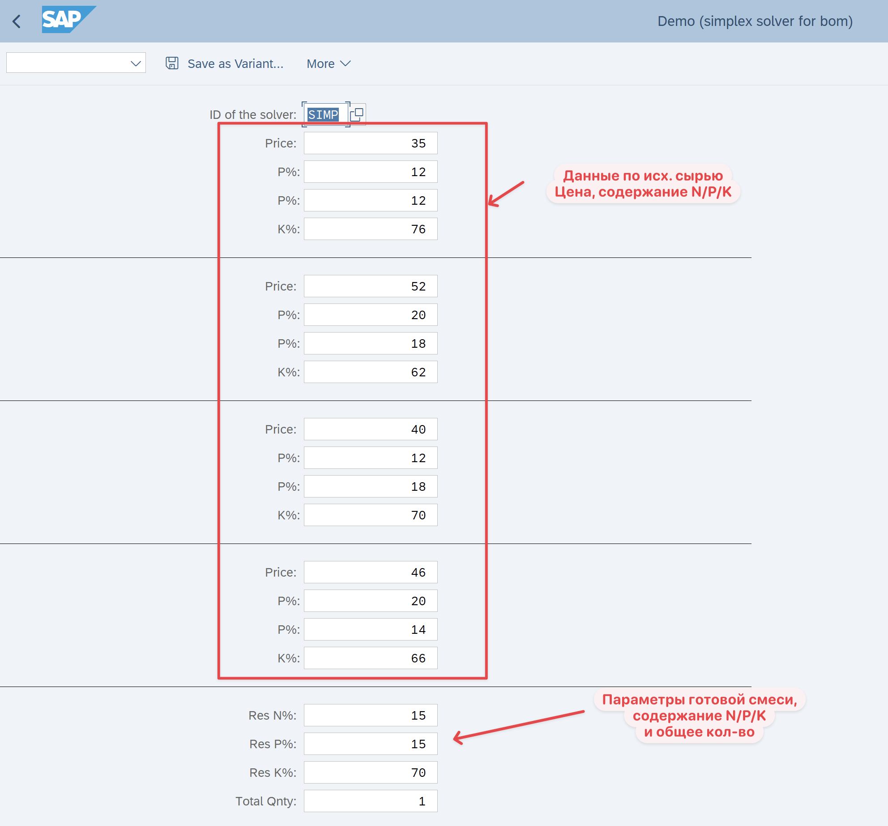
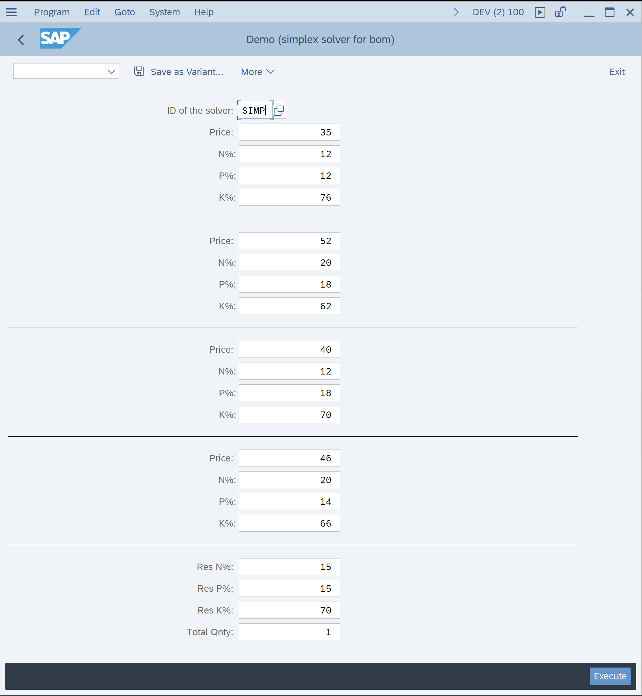
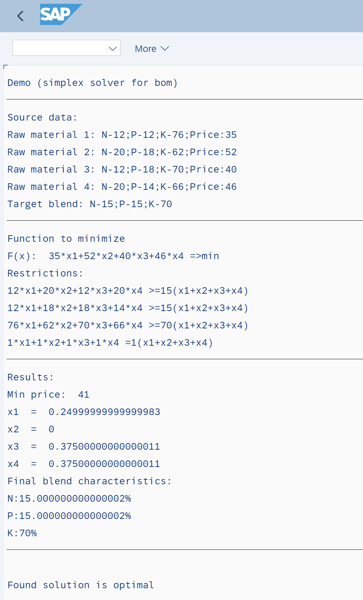

# 05_RU Formulador (ZFI_SIMP_LP_DEMO) — черновик RU

> SAP Community: https://community.sap.com/t5/technology-blogs-by-members/linear-programming-in-abap-simplex-method-find-optimised-bom/ba-p/13661302

---

Пруф оф концепт самописного формуладора


## Задача (условие)

Я ее сам выдумал конечно, но на то это и концепт. Для проверки взял условия из решебника математических задач, чтоб точно было с чем сравнить результат)

Допустим нужно создать смесь которая должна содержать компоненты:

- N - не меньше 15%,
- P - не меньше 15%,
- K – не меньше 70%.

Есть четыре материала-сырья, процентный состав и цены на которые приведенные в таблице:

| Элементы | Сырье |  |  |  |
|---|---|---|---|---|
|  | м1 | м2 | м3 | м4 |
| N | 12 | 20 | 12 | 20 |
| P | 12 | 18 | 18 | 14 |
| K | 76 | 62 | 70 | 66 |
| **Цена на 1 кг** | **35** | **52** | **40** | **46** |

Рассчитать количество элементов для бленда каждого вида, необходимое для 1 кг смеси, которая бы обеспечила минимальные затраты.


Составим экономико-математическую модель задачи.
Обозначим через
x1 – количество сырья м1, кг
x2 – количество сырья м2, кг
x3 – количество сырья м3, кг
x4 – количество сырья м4, кг

Система ограничений по содержанию
12x1 + 20x2 + 12x3 + 20x4 ≥ 15(x1 + x2 + x3 + x4)
12x1 + 18x2 + 18x3 + 14x4 ≥ 15(x1 + x2 + x3 + x4)
76x1 + 62x2 + 70x3 + 66x4 = 70(x1 + x2 + x3 + x4)

Ограничение по количеству
x1 + x2 + x3 + x4 = 1 (кг)

Целевая функция (минимизация себестоимости)
35x1 + 52x2 + 40x3 + 46x4  → min


## Ответ (классический расчет через математику)

Ответ (решение симплекс методом приведено ниже):

- x1 = 0,25;
- x2 = 0;
- x3 = 0,375;
- x4 = 0,375
Цена = 35*0,25 + 52*0 +40*0,375 + 46*0,375 = 8,75 + 15 +17,25 = 41

## Реализация в SAP

Это просто концепт собранный на коленке, но докрутить туда считывание материалов, реальные цены итд – не выглядит сложной задачей. Для концепта содержания N/P/K и цены я ввожу просто на селекционном экране. Так же как и условия для готовой смеси.

Тестовая программа в DEV100 - **ZFI_SIMP_LP_DEMO**

**Сел экран:**







Я захардкодил что условия содержания в готовой смеси это «больше или равно», но естественно это только ради проверки идеи.

**Результат расчета:**




Т.е. тут указаны сколько надо взять материалов 1,2,3 и 4 чтобы получить заданную смесь нужных параметров и с минимальной себестоимостью.


Так же тут можно добавить любые другие ограничения (с т.з. логики это просто еще одно условие в системе линейных неравенств или уравнений)

**Исходный код примера:**

```abap
*&---------------------------------------------------------------------*
*& Report ZFI_SIMP_LP_DEMO
*&---------------------------------------------------------------------*
*& Amelin A. 2024
* LP demo. Simplex solver. Find min BOM value
* Пример поиска оптимальной спецификации. Решает систему линейных неравенств (симплекс метод)
*
*   Тестовый пример:
*     Система ограничений по содержанию
*       12x1 + 20x2 + 12x3 + 20x4 ≥ 15(x1 + x2 + x3 + x4)
*       12x1 + 18x2 + 18x3 + 14x4 ≥ 15(x1 + x2 + x3 + x4)
*       76x1 + 62x2 + 70x3 + 66x4 = 70(x1 + x2 + x3 + x4)
*
*     Ограничение по количеству
*       x1 + x2 + x3 + x4 = 1 (кг)
*
*     Целевая функция (минимизация себестоимости)
*       35x1 + 52x2 + 40x3 + 46x4  → min
*
*     Для проверки (решение)
*          x1 = 0,25;
*          x2 = 0;
*          x3 = 0,375;
*          x4 = 0,375
*&---------------------------------------------------------------------*
REPORT zfi_simp_lp_demo.

PARAMETERS:
  SolverID TYPE genios_solverid DEFAULT 'SIMP'.
PARAMETERS:
  p_pr1 TYPE i DEFAULT 35,
  p_n1  TYPE i DEFAULT 12,
  p_p1  TYPE i DEFAULT 12,
  p_k1  TYPE i DEFAULT 76.
SELECTION-SCREEN ULINE.
PARAMETERS:
  p_pr2 TYPE i DEFAULT 52,
  p_n2  TYPE i DEFAULT 20,
  p_p2  TYPE i DEFAULT 18,
  p_k2  TYPE i DEFAULT 62.
SELECTION-SCREEN ULINE.
PARAMETERS:
  p_pr3 TYPE i DEFAULT 40,
  p_n3  TYPE i DEFAULT 12,
  p_p3  TYPE i DEFAULT 18,
  p_k3  TYPE i DEFAULT 70.
SELECTION-SCREEN ULINE.
PARAMETERS:
  p_pr4 TYPE i DEFAULT 46,
  p_n4  TYPE i DEFAULT 20,
  p_p4  TYPE i DEFAULT 14,
  p_k4  TYPE i DEFAULT 66.
SELECTION-SCREEN ULINE.
PARAMETERS:
  p_nt TYPE i DEFAULT 15,
  p_pt TYPE i DEFAULT 15,
  p_kt TYPE i DEFAULT 70,
  p_tt TYPE i DEFAULT 1.

**********************************************************************
CONSTANTS:
  lc_modelname TYPE genios_name VALUE 'DEMO'.

**********************************************************************
START-OF-SELECTION.
  CHECK p_tt NE 0. "divide check
*Variables
  DATA:
    pr_1  TYPE genios_float,
    pr_2  TYPE genios_float,
    pr_3  TYPE genios_float,
    pr_4  TYPE genios_float,
    n_1   TYPE genios_float,
    n_2   TYPE genios_float,
    n_3   TYPE genios_float,
    n_4   TYPE genios_float,
    p_1   TYPE genios_float,
    p_2   TYPE genios_float,
    p_3   TYPE genios_float,
    p_4   TYPE genios_float,
    k_1   TYPE genios_float,
    k_2   TYPE genios_float,
    k_3   TYPE genios_float,
    k_4   TYPE genios_float,
    x_1   TYPE genios_float,
    x_2   TYPE genios_float,
    x_3   TYPE genios_float,
    x_4   TYPE genios_float,
    n_tot TYPE genios_float,
    p_tot TYPE genios_float,
    k_tot TYPE genios_float,
    tt    TYPE genios_float,
    lo_x1 TYPE REF TO cl_genios_variable,
    lo_x2 TYPE REF TO cl_genios_variable,
    lo_x3 TYPE REF TO cl_genios_variable,
    lo_x4 TYPE REF TO cl_genios_variable.


* 0) copy sscr data to float variables
  pr_1  = p_pr1.
  pr_2  = p_pr2.
  pr_3  = p_pr3.
  pr_4  = p_pr4.
  n_1   = p_n1.
  n_2   = p_n2.
  n_3   = p_n3.
  n_4   = p_n4.
  p_1   = p_p1.
  p_2   = p_p2.
  p_3   = p_p3.
  p_4   = p_p4.
  k_1   = p_k1.
  k_2   = p_k2.
  k_3   = p_k3.
  k_4   = p_k4.
  n_tot = p_nt.
  p_tot = p_pt.
  k_tot = p_kt.
  tt    = p_tt.

* Input data. Log
  WRITE: / |{ 'Source data:' }|.
  WRITE: / |{ 'Raw material 1: N-' && p_n1 && ';P-' && p_p1 && ';K-' && p_k1 && ';Price:' && p_pr1 }|.
  WRITE: / |{ 'Raw material 2: N-' && p_n2 && ';P-' && p_p2 && ';K-' && p_k2 && ';Price:' && p_pr2 }|.
  WRITE: / |{ 'Raw material 3: N-' && p_n3 && ';P-' && p_p3 && ';K-' && p_k3 && ';Price:' && p_pr3 }|.
  WRITE: / |{ 'Raw material 4: N-' && p_n4 && ';P-' && p_p4 && ';K-' && p_k4 && ';Price:' && p_pr4 }|.
  WRITE: / |{ 'Target blend: N-' && p_nt && ';P-' && p_pt && ';K-' && p_kt }|.
  ULINE.


  DATA:
    lo_env TYPE REF TO cl_genios_environment,
    lx_env TYPE REF TO cx_genios_environment,
    lv_msg TYPE string.

* 1) create a genios environment object
  lo_env = cl_genios_environment=>get_environment( ).

  DATA:
    lo_model TYPE REF TO cl_genios_model.
  TRY.
* 2) create a genios model (with a context-unique name)
      lo_model = lo_env->create_model( lc_modelname ).
    CATCH cx_genios_environment INTO lx_env.
      lv_msg = lx_env->get_text( ).
      WRITE: lv_msg, /.
      EXIT.
  ENDTRY.

* 3) fill the model with data
* 3.1) create the objective object
  DATA:
    lo_obj TYPE REF TO cl_genios_objective.
  lo_obj = lo_model->create_objective( if_genios_model_c=>gc_obj_minimization ).

* 3.2) create the needed variables
  lo_x1 = lo_model->create_variable( iv_name = 'x1' iv_type = if_genios_model_c=>gc_var_continuous ).
  lo_x2 = lo_model->create_variable( iv_name = 'x2' iv_type = if_genios_model_c=>gc_var_continuous ).
  lo_x3 = lo_model->create_variable( iv_name = 'x3' iv_type = if_genios_model_c=>gc_var_continuous ).
  lo_x4 = lo_model->create_variable( iv_name = 'x4' iv_type = if_genios_model_c=>gc_var_continuous ).

* 3.3) add the monom for the objective function
*      this is the coefficient for each variable in the objective function
  lo_obj->add_monom( io_variable = lo_x1 iv_coefficient = pr_1 ). "material price
  lo_obj->add_monom( io_variable = lo_x2 iv_coefficient = pr_2 ).
  lo_obj->add_monom( io_variable = lo_x3 iv_coefficient = pr_3 ).
  lo_obj->add_monom( io_variable = lo_x4 iv_coefficient = pr_4 ).

* 3.4) add the linear constraints with their monomes (coefficients for the variables
  DATA: lo_lin TYPE REF TO cl_genios_linearconstraint.

  lo_lin = lo_model->create_linearconstraint( iv_name = 'n' iv_type = if_genios_model_c=>gc_con_greaterorequal iv_righthandside = n_tot ).
  lo_lin->add_monom( io_variable = lo_x1 iv_coefficient = n_1 ).
  lo_lin->add_monom( io_variable = lo_x2 iv_coefficient = n_2 ).
  lo_lin->add_monom( io_variable = lo_x3 iv_coefficient = n_3 ).
  lo_lin->add_monom( io_variable = lo_x4 iv_coefficient = n_4 ).

  lo_lin = lo_model->create_linearconstraint( iv_name = 'p' iv_type = if_genios_model_c=>gc_con_greaterorequal iv_righthandside = p_tot ).
  lo_lin->add_monom( io_variable = lo_x1 iv_coefficient = p_1 ).
  lo_lin->add_monom( io_variable = lo_x2 iv_coefficient = p_2 ).
  lo_lin->add_monom( io_variable = lo_x3 iv_coefficient = p_3 ).
  lo_lin->add_monom( io_variable = lo_x4 iv_coefficient = p_4 ).

  lo_lin = lo_model->create_linearconstraint( iv_name = 'k' iv_type = if_genios_model_c=>gc_con_greaterorequal iv_righthandside = k_tot ).
  lo_lin->add_monom( io_variable = lo_x1 iv_coefficient = k_1 ).
  lo_lin->add_monom( io_variable = lo_x2 iv_coefficient = k_2 ).
  lo_lin->add_monom( io_variable = lo_x3 iv_coefficient = k_3 ).
  lo_lin->add_monom( io_variable = lo_x4 iv_coefficient = k_4 ).

  lo_lin = lo_model->create_linearconstraint( iv_name = 'total' iv_type = if_genios_model_c=>gc_con_equal iv_righthandside = 1 ).
  lo_lin->add_monom( io_variable = lo_x1 iv_coefficient = 1 ).
  lo_lin->add_monom( io_variable = lo_x2 iv_coefficient = 1 ).
  lo_lin->add_monom( io_variable = lo_x3 iv_coefficient = 1 ).
  lo_lin->add_monom( io_variable = lo_x4 iv_coefficient = 1 ).

* 4) as the model is filled, we now create a solver with a ID out of tx genios_solver (in this case, the default SIMPLEX solver)
  DATA:
    lo_solver TYPE REF TO cl_genios_solver,
    lx_solver TYPE REF TO cx_genios_solver.
  TRY.
      lo_solver ?= lo_env->create_solver( SolverID ).
    CATCH cx_genios_environment INTO lx_env.
      lv_msg = lx_env->get_text( ).
      WRITE: lv_msg, /.
      EXIT.
  ENDTRY.

* 4.1) load the model into the solver and solve it
  DATA:
    ls_result TYPE genioss_solver_result,
    lo_param  TYPE REF TO cl_genios_parameter.
  TRY.
      CREATE OBJECT lo_param
        EXPORTING
          iv_solver_id = lo_solver->get_solverid( ).
      lo_param->mv_timelimit = 300. " its a good idea to se a runtime - its only relevant for MILP runs, but ...

      lo_solver->load_model( lo_model ).
      ls_result = lo_solver->solve( lo_param ).
    CATCH cx_genios_solver INTO lx_solver.
      lv_msg = lx_solver->get_text( ).
      WRITE: lv_msg, /.
      EXIT.
  ENDTRY.

* 4.2) evaluate the results
  DATA:
    lt_variables   TYPE geniost_variable,
    ls_variable    TYPE genioss_variable,
    lv_primalvalue TYPE genios_float,
    lv_name        TYPE string,
    lv_index       TYPE string.
  IF ( ls_result-solution_status = if_genios_solver_result_c=>gc_optimal
     OR ls_result-solution_status = if_genios_solver_result_c=>gc_abortfeasible ).
* 4.3) found a solution => output the objective value as well as the variable values
    lv_primalvalue = lo_obj->get_value( ).
    WRITE: / 'Function to minimize'.
    WRITE: / 'F(x): ', |{ p_pr1 && '*x1+' && p_pr2 && '*x2+' &&  p_pr3 && '*x3+' && p_pr4 && '*x4 =>min' }|.
    WRITE: / 'Restrictions:'.
    WRITE: / |{ p_n1 && '*x1+' &&  p_n2 && '*x2+' &&  p_n3 && '*x3+' &&  p_n4 && '*x4 >=' &&  n_tot && '(x1+x2+x3+x4)' }|.
    WRITE: / |{ p_p1 && '*x1+' &&  p_p2 && '*x2+' &&  p_p3 && '*x3+' &&  p_p4 && '*x4 >=' &&  p_tot && '(x1+x2+x3+x4)' }|.
    WRITE: / |{ p_k1 && '*x1+' &&  p_k2 && '*x2+' &&  p_k3 && '*x3+' &&  p_k4 && '*x4 >=' &&  k_tot && '(x1+x2+x3+x4)' }|.
    WRITE: / |{ tt && '*x1+' &&  tt && '*x2+' &&  tt && '*x3+' &&  tt && '*x4 =' &&  tt && '(x1+x2+x3+x4)' }|.
    ULINE.
    WRITE: / 'Results:'.
    WRITE: /'Min price: ', |{ lv_primalvalue * tt }|.       "#EC NOTEXT
    lt_variables = lo_model->get_variables( ).
    LOOP AT lt_variables INTO ls_variable.
      lv_primalvalue = 0.
      lv_name = ls_variable-variable_ref->gv_name.
      lv_index = ls_variable-variable_index.
      lv_primalvalue = ls_variable-variable_ref->get_primalvalue( ).
      WRITE: / lv_name,' = ',|{ lv_primalvalue * tt }|.
      IF lv_name = 'x1'.
        x_1 = lv_primalvalue * tt.
      ELSEIF lv_name = 'x2'.
        x_2 = lv_primalvalue * tt.
      ELSEIF lv_name = 'x3'.
        x_3 = lv_primalvalue * tt.
      ELSEIF lv_name = 'x4'.
        x_4 = lv_primalvalue * tt.
      ENDIF.
    ENDLOOP.
    WRITE: / 'Final blend characteristics:'.
    WRITE: /  'N:' && |{ ( ( ( x_1 * p_n1 ) + ( x_2 * p_n2 ) + ( x_3 * p_n3 ) + ( x_4 * p_n4 ) ) / tt ) }| && '%'.
    WRITE: /  'P:' && |{ ( ( ( x_1 * p_p1 ) + ( x_2 * p_p2 ) + ( x_3 * p_p3 ) + ( x_4 * p_p4 ) ) / tt ) }| && '%'.
    WRITE: /  'K:' && |{ ( ( ( x_1 * p_k1 ) + ( x_2 * p_k2 ) + ( x_3 * p_k3 ) + ( x_4 * p_k4 ) ) / tt ) }| && '%'.
  ENDIF.
  ULINE.
* 4.4) output the solution status
  IF ( ls_result-solution_status = if_genios_solver_result_c=>gc_optimal ).
    WRITE: /,'Found solution is optimal'.
  ELSEIF ( ls_result-solution_status = if_genios_solver_result_c=>gc_abortfeasible ).
    WRITE: /,'Solver aborted with a feasible solution'.
  ELSEIF ( ls_result-solution_status = if_genios_solver_result_c=>gc_abortinfeasible ).
    WRITE: /,'Solver aborted with an infeasible solution'.
  ELSEIF ( ls_result-solution_status = if_genios_solver_result_c=>gc_failinfeasible ).
    WRITE: /,'Solver failed due to infeasibility'.
  ELSEIF ( ls_result-solution_status = if_genios_solver_result_c=>gc_solutionlimitreached ).
    WRITE: /,'Solution limit reached, but the a solution has been found'.
  ELSEIF ( ls_result-solution_status = if_genios_solver_result_c=>gc_timelimitinfeasible ).
    WRITE: /,'Time limit reached and the solution is infeasible'.
  ELSEIF ( ls_result-solution_status = if_genios_solver_result_c=>gc_unknown ).
    WRITE: /,'Solution status is unknown'.
  ENDIF.

* 5) some cleanup
  IF ( lo_env IS BOUND ).
    lo_env->destroy_solver( SolverID ).
    lo_env->destroy_model( lc_modelname ).
  ENDIF.
```

**Что тут под капотом:**

В SAP S/4 есть класс для работы с линейным программированием - cl_genios_environment, это часть пакета GENIOS_MAIN в GENIOS_FRAMEWORK (все это относится к компоненту CA-EPT-GEN «GENeric Integer Optimizer System»).

У него есть 3 солвера для классических систем линейных неравенств:

- MILP    GENIOS: Externer MILP Solver
- SIMP    GENIOS: internal simplex solver
- WEBS    GENIOS: WebService solver
Я использовал встроенный SIMP, т.е. все расчеты внутри выполняются у нас на сервере. По сути это просто решатель систем уравнений/неравенств (там внутри сложная логика схожая с симплекс методом, но на самом деле это не важно). Из плюсов – это стандартный SAP S/4 функционал.

## Решение (классическое, для проверки)

**Двойственный симплекс-метод**.
Решим прямую задачу линейного программирования двойственным симплексным методом, с использованием симплексной таблицы.
Определим минимальное значение целевой функции F(X) = 35x1+52x2+40x3+46x4 при следующих условиях-ограничений.
12x1+20x2+12x3+20x4≤15
12x1+18x2+18x3+14x4≤15
76x1+62x2+70x3+66x4≤70
x1+x2+x3+x4=1


Для построения первого опорного плана систему неравенств приведем к системе уравнений путем введения дополнительных переменных (**переход к канонической форме**).
В 1-м неравенстве смысла (≤) вводим базисную переменную x5.

В 2-м неравенстве смысла (≤) вводим базисную переменную x6.

В 3-м неравенстве смысла (≤) вводим базисную переменную x7.
12x1+20x2+12x3+20x4+x5 = 15
12x1+18x2+18x3+14x4+x6 = 15
76x1+62x2+70x3+66x4+x7 = 70
x1+x2+x3+x4 = 1

Расширенная матрица системы ограничений-равенств данной задачи:

| 12 | 20 | 12 | 20 | 1 | 0 | 0 | 15 |
|---|---|---|---|---|---|---|---|
| 12 | 18 | 18 | 14 | 0 | 1 | 0 | 15 |
| 76 | 62 | 70 | 66 | 0 | 0 | 1 | 70 |
| 1 | 1 | 1 | 1 | 0 | 0 | 0 | 1 |


Приведем систему к единичной матрице методом жордановских преобразований.
1. В качестве базовой переменной можно выбрать x5.
2. В качестве базовой переменной можно выбрать x6.
3. В качестве базовой переменной можно выбрать x7.
4. В качестве базовой переменной можно выбрать x4.

Разрешающий элемент РЭ=1. Строка, соответствующая переменной x4, получена в результате деления всех элементов строки x4 на разрешающий элемент РЭ=1. На месте разрешающего элемента получаем 1. В остальных клетках столбца x4 записываем нули.
Все остальные элементы определяются по правилу прямоугольника.
Представим расчет каждого элемента в виде таблицы:

| 12-(1*20):1 | 20-(1*20):1 | 12-(1*20):1 | 20-(1*20):1 | 1-(0*20):1 | 0-(0*20):1 | 0-(0*20):1 | 15-(1*20):1 |
|---|---|---|---|---|---|---|---|
| 12-(1*14):1 | 18-(1*14):1 | 18-(1*14):1 | 14-(1*14):1 | 0-(0*14):1 | 1-(0*14):1 | 0-(0*14):1 | 15-(1*14):1 |
| 76-(1*66):1 | 62-(1*66):1 | 70-(1*66):1 | 66-(1*66):1 | 0-(0*66):1 | 0-(0*66):1 | 1-(0*66):1 | 70-(1*66):1 |
| 1 : 1 | 1 : 1 | 1 : 1 | 1 : 1 | 0 : 1 | 0 : 1 | 0 : 1 | 1 : 1 |


Получаем новую матрицу:

| -8 | 0 | -8 | 0 | 1 | 0 | 0 | -5 |
|---|---|---|---|---|---|---|---|
| -2 | 4 | 4 | 0 | 0 | 1 | 0 | 1 |
| 10 | -4 | 4 | 0 | 0 | 0 | 1 | 4 |
| 1 | 1 | 1 | 1 | 0 | 0 | 0 | 1 |


Поскольку в системе имеется единичная матрица, то в качестве базисных переменных принимаем X = (5,6,7,4).
Выразим базисные переменные через остальные:
x5 = 8x1+8x3-5
x6 = 2x1-4x2-4x3+1
x7 = -10x1+4x2-4x3+4
x4 = -x1-x2-x3+1
Подставим их в целевую функцию:
F(X) = 35x1+52x2+40x3+46(-x1-x2-x3+1)
или
F(X) = -11x1+6x2-6x3+46
-8x1-8x3+x5=-5
-2x1+4x2+4x3+x6=1
10x1-4x2+4x3+x7=4
x1+x2+x3+x4=1
При вычислениях значение Fc = 46 временно не учитываем.
Матрица коэффициентов A = a(ij) этой системы уравнений имеет вид:

| -8 | 0 | -8 | 0 | 1 | 0 | 0 |
|---|---|---|---|---|---|---|
| -2 | 4 | 4 | 0 | 0 | 1 | 0 |
| 10 | -4 | 4 | 0 | 0 | 0 | 1 |
| 1 | 1 | 1 | 1 | 0 | 0 | 0 |


**Базисные переменные** это переменные, которые входят только в одно уравнение системы ограничений и притом с единичным коэффициентом.
**Экономический смысл дополнительных переменных**: дополнительные переменные задачи ЛП обозначают излишки сырья, времени, других ресурсов, остающихся в производстве данного оптимального плана.
Решим систему уравнений относительно базисных переменных: x5, x6, x7, x4
Полагая, что **свободные переменные** равны 0, получим первый опорный план:
X0 = (0,0,0,1,-5,1,4)
**Базисное решение** называется допустимым, если оно неотрицательно.

| Базис | B | x1 | x2 | x3 | x4 | x5 | x6 | x7 |
|---|---|---|---|---|---|---|---|---|
| x5 | -5 | -8 | 0 | -8 | 0 | 1 | 0 | 0 |
| x6 | 1 | -2 | 4 | 4 | 0 | 0 | 1 | 0 |
| x7 | 4 | 10 | -4 | 4 | 0 | 0 | 0 | 1 |
| x4 | 1 | 1 | 1 | 1 | 1 | 0 | 0 | 0 |
| F(X0) | 0 | 11 | -6 | 6 | 0 | 0 | 0 | 0 |


**1. Проверка критерия оптимальности**.
План 0 в симплексной таблице **является псевдопланом**, поэтому определяем ведущие строку и столбец.
**2. Определение новой свободной переменной**.
Среди отрицательных значений базисных переменных выбираем наибольший по модулю.
Ведущей будет 1-ая строка, а переменную x5 следует вывести из базиса.
**3. Определение новой базисной переменной**.
Минимальное значение θ соответствует 3-му столбцу, т.е. переменную x3 необходимо ввести в базис.
На пересечении ведущих строки и столбца находится разрешающий элемент (РЭ), равный (-8).

| Базис | B | x1 | x2 | x3 | x4 | x5 | x6 | x7 |
|---|---|---|---|---|---|---|---|---|
| x5 | -5 | -8 | 0 | -8 | 0 | 1 | 0 | 0 |
| x6 | 1 | -2 | 4 | 4 | 0 | 0 | 1 | 0 |
| x7 | 4 | 10 | -4 | 4 | 0 | 0 | 0 | 1 |
| x4 | 1 | 1 | 1 | 1 | 1 | 0 | 0 | 0 |
| F(X0) | 0 | 11 | -6 | 6 | 0 | 0 | 0 | 0 |
| θ |  | 11 : (-8) = -11/8 | - | 6 : (-8) = -3/4 | - | - | - | - |


**4. Пересчет симплекс-таблицы**.
Выполняем преобразования симплексной таблицы методом Жордано-Гаусса.

| Базис | B | x1 | x2 | x3 | x4 | x5 | x6 | x7 |
|---|---|---|---|---|---|---|---|---|
| x3 | 5/8 | 1 | 0 | 1 | 0 | -1/8 | 0 | 0 |
| x6 | -3/2 | -6 | 4 | 0 | 0 | 1/2 | 1 | 0 |
| x7 | 3/2 | 6 | -4 | 0 | 0 | 1/2 | 0 | 1 |
| x4 | 3/8 | 0 | 1 | 0 | 1 | 1/8 | 0 | 0 |
| F(X0) | -15/4 | 5 | -6 | 0 | 0 | 3/4 | 0 | 0 |


Представим расчет каждого элемента в виде таблицы:

| B | x1 | x2 | x3 | x4 | x5 | x6 | x7 |
|---|---|---|---|---|---|---|---|
| -5 : -8 | -8 : -8 | 0 : -8 | -8 : -8 | 0 : -8 | 1 : -8 | 0 : -8 | 0 : -8 |
| 1-(-5*4):-8 | -2-(-8*4):-8 | 4-(0*4):-8 | 4-(-8*4):-8 | 0-(0*4):-8 | 0-(1*4):-8 | 1-(0*4):-8 | 0-(0*4):-8 |
| 4-(-5*4):-8 | 10-(-8*4):-8 | -4-(0*4):-8 | 4-(-8*4):-8 | 0-(0*4):-8 | 0-(1*4):-8 | 0-(0*4):-8 | 1-(0*4):-8 |
| 1-(-5*1):-8 | 1-(-8*1):-8 | 1-(0*1):-8 | 1-(-8*1):-8 | 1-(0*1):-8 | 0-(1*1):-8 | 0-(0*1):-8 | 0-(0*1):-8 |
| 0-(-5*6):-8 | 11-(-8*6):-8 | -6-(0*6):-8 | 6-(-8*6):-8 | 0-(0*6):-8 | 0-(1*6):-8 | 0-(0*6):-8 | 0-(0*6):-8 |


**1. Проверка критерия оптимальности**.
План 1 в симплексной таблице **является псевдопланом**, поэтому определяем ведущие строку и столбец.
**2. Определение новой свободной переменной**.
Среди отрицательных значений базисных переменных выбираем наибольший по модулю.
Ведущей будет 2-ая строка, а переменную x6 следует вывести из базиса.
**3. Определение новой базисной переменной**.
Минимальное значение θ соответствует 1-му столбцу, т.е. переменную x1 необходимо ввести в базис.
На пересечении ведущих строки и столбца находится разрешающий элемент (РЭ), равный (-6).

| Базис | B | x1 | x2 | x3 | x4 | x5 | x6 | x7 |
|---|---|---|---|---|---|---|---|---|
| x3 | 5/8 | 1 | 0 | 1 | 0 | -1/8 | 0 | 0 |
| x6 | -3/2 | -6 | 4 | 0 | 0 | 1/2 | 1 | 0 |
| x7 | 3/2 | 6 | -4 | 0 | 0 | 1/2 | 0 | 1 |
| x4 | 3/8 | 0 | 1 | 0 | 1 | 1/8 | 0 | 0 |
| F(X0) | -15/4 | 5 | -6 | 0 | 0 | 3/4 | 0 | 0 |
| θ |  | 5 : (-6) = -5/6 | - | - | - | - | - | - |


**4. Пересчет симплекс-таблицы**.
Выполняем преобразования симплексной таблицы методом Жордано-Гаусса.

| Базис | B | x1 | x2 | x3 | x4 | x5 | x6 | x7 |
|---|---|---|---|---|---|---|---|---|
| x3 | 3/8 | 0 | 2/3 | 1 | 0 | -1/24 | 1/6 | 0 |
| x1 | 1/4 | 1 | -2/3 | 0 | 0 | -1/12 | -1/6 | 0 |
| x7 | 0 | 0 | 0 | 0 | 0 | 1 | 1 | 1 |
| x4 | 3/8 | 0 | 1 | 0 | 1 | 1/8 | 0 | 0 |
| F(X1) | -5 | 0 | -8/3 | 0 | 0 | 7/6 | 5/6 | 0 |


Представим расчет каждого элемента в виде таблицы:

| B | x1 | x2 | x3 | x4 | x5 | x6 | x7 |
|---|---|---|---|---|---|---|---|
| 5/8-(-3/2*1):-6 | 1-(-6*1):-6 | 0-(4*1):-6 | 1-(0*1):-6 | 0-(0*1):-6 | -1/8-(1/2*1):-6 | 0-(1*1):-6 | 0-(0*1):-6 |
| -3/2 : -6 | -6 : -6 | 4 : -6 | 0 : -6 | 0 : -6 | 1/2 : -6 | 1 : -6 | 0 : -6 |
| 3/2-(-3/2*6):-6 | 6-(-6*6):-6 | -4-(4*6):-6 | 0-(0*6):-6 | 0-(0*6):-6 | 1/2-(1/2*6):-6 | 0-(1*6):-6 | 1-(0*6):-6 |
| 3/8-(-3/2*0):-6 | 0-(-6*0):-6 | 1-(4*0):-6 | 0-(0*0):-6 | 1-(0*0):-6 | 1/8-(1/2*0):-6 | 0-(1*0):-6 | 0-(0*0):-6 |
| -15/4-(-3/2*5):-6 | 5-(-6*5):-6 | -6-(4*5):-6 | 0-(0*5):-6 | 0-(0*5):-6 | 3/4-(1/2*5):-6 | 0-(1*5):-6 | 0-(0*5):-6 |


В базисном столбце все элементы положительные.
Переходим к основному алгоритму симплекс-метода.
**Итерация №0**.
**1. Проверка критерия оптимальности**.
Текущий опорный план неоптимален, так как в индексной строке находятся положительные коэффициенты.
**2. Определение новой базисной переменной**.
В качестве ведущего выберем столбец, соответствующий переменной x5, так как это наибольший коэффициент.
**3. Определение новой свободной переменной**.
Вычислим значения Di по строкам как частное от деления: bi / ai5
и из них выберем наименьшее:
min (- , - , 0 : 1 , 3/8 : 1/8 ) = 0
Следовательно, 3-ая строка является ведущей.
Разрешающий элемент равен (1) и находится на пересечении ведущего столбца и ведущей строки.

| Базис | B | x1 | x2 | x3 | x4 | x5 | x6 | x7 | min |
|---|---|---|---|---|---|---|---|---|---|
| x3 | 3/8 | 0 | 2/3 | 1 | 0 | -1/24 | 1/6 | 0 | - |
| x1 | 1/4 | 1 | -2/3 | 0 | 0 | -1/12 | -1/6 | 0 | - |
| x7 | 0 | 0 | 0 | 0 | 0 | 1 | 1 | 1 | 0 |
| x4 | 3/8 | 0 | 1 | 0 | 1 | 1/8 | 0 | 0 | 3 |
| F(X1) | -5 | 0 | -8/3 | 0 | 0 | 7/6 | 5/6 | 0 | 0 |


**4. Пересчет симплекс-таблицы**.
Формируем следующую часть симплексной таблицы. Вместо переменной x7 в план 1 войдет переменная x5.
Строка, соответствующая переменной x5 в плане 1, получена в результате деления всех элементов строки x7плана 0 на разрешающий элемент РЭ=1. На месте разрешающего элемента получаем 1. В остальных клетках столбца x5 записываем нули.
Таким образом, в новом плане 1 заполнены строка x5 и столбец x5. Все остальные элементы нового плана 1, включая элементы индексной строки, определяются по правилу прямоугольника.
Для этого выбираем из старого плана четыре числа, которые расположены в вершинах прямоугольника и всегда включают разрешающий элемент РЭ.
НЭ = СЭ - (А*В)/РЭ
СТЭ - элемент старого плана, РЭ - разрешающий элемент (1), А и В - элементы старого плана, образующие прямоугольник с элементами СТЭ и РЭ.
Представим расчет каждого элемента в виде таблицы:

| B | x1 | x2 | x3 | x4 | x5 | x6 | x7 |
|---|---|---|---|---|---|---|---|
| 3/8-(0*-1/24):1 | 0-(0*-1/24):1 | 2/3-(0*-1/24):1 | 1-(0*-1/24):1 | 0-(0*-1/24):1 | -1/24-(1*-1/24):1 | 1/6-(1*-1/24):1 | 0-(1*-1/24):1 |
| 1/4-(0*-1/12):1 | 1-(0*-1/12):1 | -2/3-(0*-1/12):1 | 0-(0*-1/12):1 | 0-(0*-1/12):1 | -1/12-(1*-1/12):1 | -1/6-(1*-1/12):1 | 0-(1*-1/12):1 |
| 0 : 1 | 0 : 1 | 0 : 1 | 0 : 1 | 0 : 1 | 1 : 1 | 1 : 1 | 1 : 1 |
| 3/8-(0*1/8):1 | 0-(0*1/8):1 | 1-(0*1/8):1 | 0-(0*1/8):1 | 1-(0*1/8):1 | 1/8-(1*1/8):1 | 0-(1*1/8):1 | 0-(1*1/8):1 |
| -5-(0*7/6):1 | 0-(0*7/6):1 | -8/3-(0*7/6):1 | 0-(0*7/6):1 | 0-(0*7/6):1 | 7/6-(1*7/6):1 | 5/6-(1*7/6):1 | 0-(1*7/6):1 |


Получаем новую симплекс-таблицу:

| Базис | B | x1 | x2 | x3 | x4 | x5 | x6 | x7 |
|---|---|---|---|---|---|---|---|---|
| x3 | 3/8 | 0 | 2/3 | 1 | 0 | 0 | 5/24 | 1/24 |
| x1 | 1/4 | 1 | -2/3 | 0 | 0 | 0 | -1/12 | 1/12 |
| x5 | 0 | 0 | 0 | 0 | 0 | 1 | 1 | 1 |
| x4 | 3/8 | 0 | 1 | 0 | 1 | 0 | -1/8 | -1/8 |
| F(X1) | -5 | 0 | -8/3 | 0 | 0 | 0 | -1/3 | -7/6 |


**1. Проверка критерия оптимальности**.
Среди значений индексной строки нет положительных. Поэтому эта таблица определяет оптимальный план задачи.
Окончательный вариант симплекс-таблицы:

| Базис | B | x1 | x2 | x3 | x4 | x5 | x6 | x7 |
|---|---|---|---|---|---|---|---|---|
| x3 | 3/8 | 0 | 2/3 | 1 | 0 | 0 | 5/24 | 1/24 |
| x1 | 1/4 | 1 | -2/3 | 0 | 0 | 0 | -1/12 | 1/12 |
| x5 | 0 | 0 | 0 | 0 | 0 | 1 | 1 | 1 |
| x4 | 3/8 | 0 | 1 | 0 | 1 | 0 | -1/8 | -1/8 |
| F(X2) | -5 | 0 | -8/3 | 0 | 0 | 0 | -1/3 | -7/6 |


Оптимальный план можно записать так:
x1 = 1/4, x2 = 0, x3 = 3/8, x4 = 3/8
F(X) = 35*1/4 + 52*0 + 40*3/8 + 46*3/8 = 41
**Примечание**:
**1. По какому методу пересчитываются симплекс-таблицы?**
Используется правило прямоугольника (метод жордановских преобразований).
**2. Обязательно ли каждый раз выбирать максимальное значение из индексной строки?**
Можно не выбирать, но это может привести к зацикливанию алгоритма.
**3. В индексной строке в n-ом столбце нулевое значение. Что это означает?**
Нулевые значения должны соответствовать переменным, вошедшим в базис. Если в индексной строке симплексной таблицы оптимального плана находится нуль, принадлежащий свободной переменной, **не вошедшей** в базис, а в столбце, содержащем этот нуль, имеется хотя бы один положительный элемент, то задача имеет множество оптимальных планов.
Свободную переменную, соответствующую указанному столбцу, можно внести в базис, выполнив соответствующие этапы алгоритма. В результате будет получен второй оптимальный план с другим набором базисных переменных.
