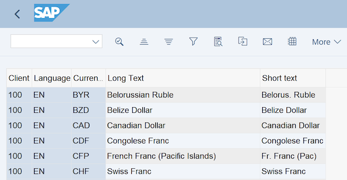

Simple way to show ALV in OO style:
``` abap
REPORT zfi_samples.  
TABLES: tcurt.  
SELECT-OPTIONS: so_spras FOR tcurt-spras DEFAULT sy-langu.  
  
START-OF-SELECTION.  
"Select data
  SELECT *  
    FROM tcurt  
    INTO TABLE @DATA(it_rep)  
    WHERE spras IN @so_spras.  
"Show ALV 
  cl_salv_table=>factory( ##EXCP_UNHANDLED[CX_SALV_MSG]  
    IMPORTING  
      r_salv_table = DATA(go_alv)  
    CHANGING  
      t_table      = it_rep[] ).  
  go_alv->get_functions( )->set_all( 'X' ). "Enable function buttons
  go_alv->get_columns( )->set_optimize( 'X' ). "Optimize Column
  go_alv->get_display_settings( )->set_striped_pattern( cl_salv_display_settings=>true ). "Enable Zebra style
  go_alv->display( ). "Display ALV
```

Result:



